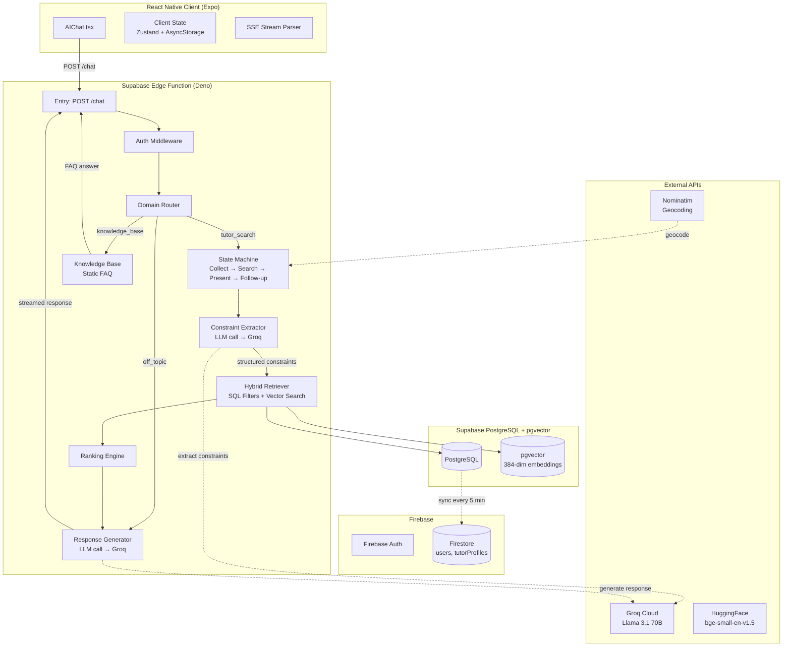
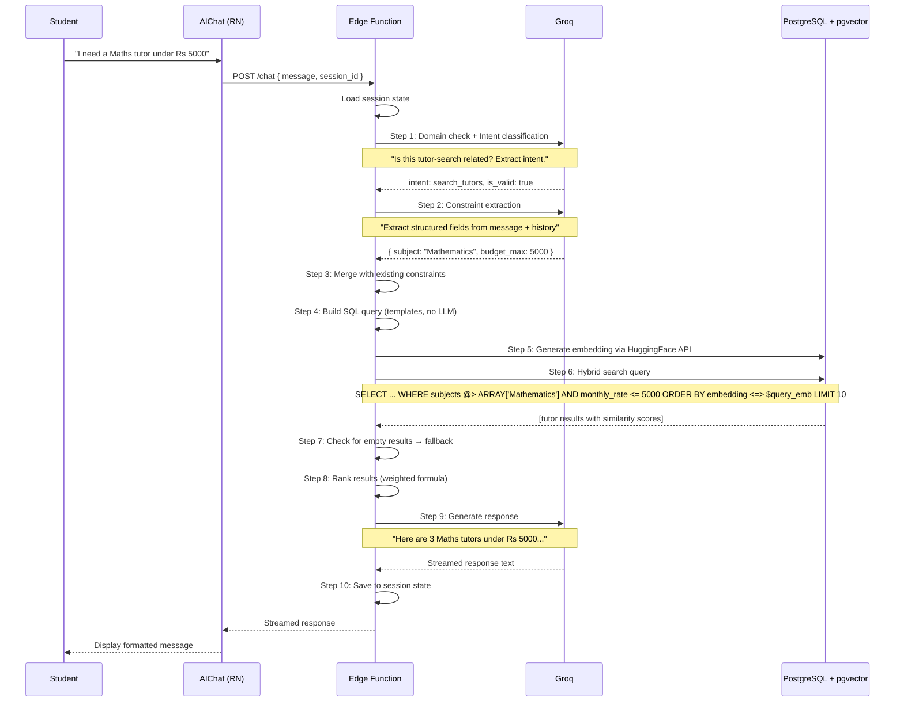
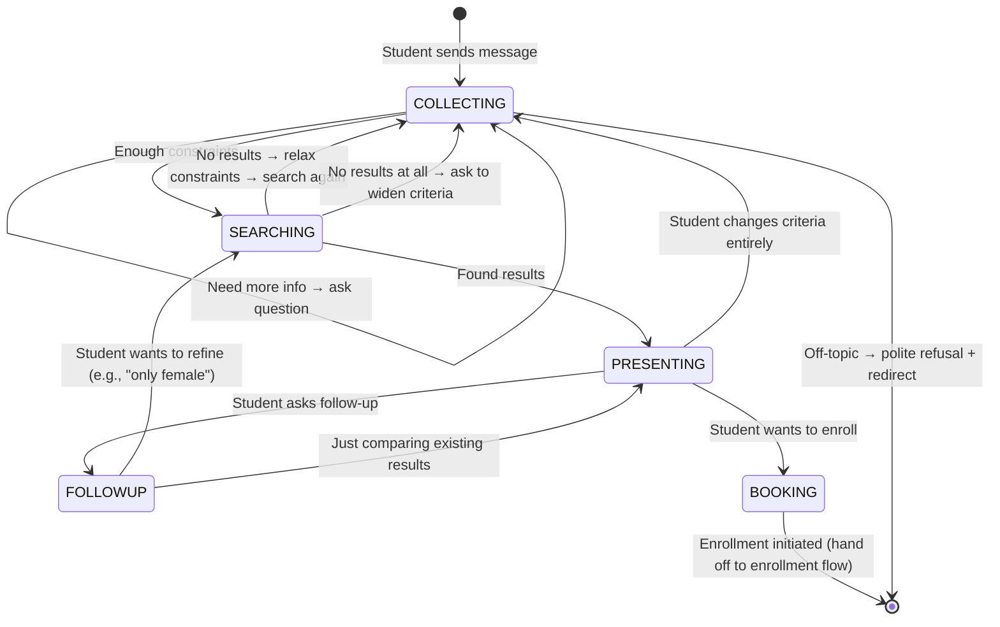

# EdumentX — AI Assistant: Practical Architecture & Implementation Guide

> **Status**: Design Document (Ready for Implementation)
> **Last updated**: July 22, 2026
> **Author**: AI Systems Architect
> **Target audience**: Engineering team (you + map teammate)

---

## Table of Contents

1. [Executive Summary](#1-executive-summary)
2. [Should This Even Be RAG? — Critical Evaluation](#2-should-this-even-be-rag--critical-evaluation)
3. [Recommended Architecture](#3-recommended-architecture)
4. [System Architecture Diagram](#4-system-architecture-diagram)
5. [Domain Restriction — Keeping the Chatbot on Topic](#5-domain-restriction--keeping-the-chatbot-on-topic)
6. [Knowledge Base Design — EdumentX-Specific Questions](#6-knowledge-base-design--edumentx-specific-questions)
7. [Recommendation Pipeline (Stage by Stage)](#7-recommendation-pipeline-stage-by-stage)
8. [Ranking Algorithm](#8-ranking-algorithm)
9. [Conversation Memory Strategy](#9-conversation-memory-strategy)
10. [Map Integration Strategy — Parallel Development](#10-map-integration-strategy--parallel-development)
11. [API Design](#11-api-design)
12. [Folder Structure](#12-folder-structure)
13. [Step-by-Step Implementation Roadmap](#13-step-by-step-implementation-roadmap)
14. [Future Enhancements](#14-future-enhancements)
15. [Risks & Mitigation Strategies](#15-risks--mitigation-strategies)

---

## 1. Executive Summary

The AI Assistant is **not** a general-purpose chatbot. It has one job: help students discover suitable tutors through natural conversation.

**What it does:**
- Understands what the student needs (subject, level, budget, preferences)
- Searches the tutor database using structured filters (SQL) + semantic matching (vector search)
- Presents recommendations conversationally
- Remembers context across turns
- Refuses off-topic questions politely

**What it does NOT do:**
- Answer general knowledge questions
- Write code, essays, or assignments
- Hallucinate tutor profiles
- Make promises about pricing or availability

### Key Architectural Decisions

| Decision | Choice | Why |
|----------|--------|-----|
| Not pure RAG ✅ | Hybrid SQL + Vector search | Structured filters (budget, subjects) + semantic matching (bio, teaching style) |
| No LangGraph for MVP | Simple state machine in Edge Function | Less complexity, faster to ship, still maintainable |
| Tool-calling LLM | Groq (Llama 3.1 70B) | Free tier, fast inference, excellent structured output |
| Embeddings | bge-small-en-v1.5 (384 dims) | Fast, free via HuggingFace, good quality for MVP |
| Conversation memory | Structured session state (JSON in PostgreSQL) | Lightweight, queryable, no LangGraph dependency |
| Knowledge base | Static prompt injection + embedded FAQ | No RAG pipeline needed for Q&A — simpler and cheaper |
| Domain restriction | Intent classification + guardrails prompt | No external service needed, works with the same LLM call |

### Current Project State

- **Firebase Auth**: working (Email + Password, Google Sign-In)
- **Firestore**: source of truth for users, tutor profiles
- **Supabase Storage**: working (avatars, verification docs)
- **Supabase PostgreSQL**: **Not set up yet** — needs pgvector extension
- **Supabase Edge Functions**: **Not deployed yet**
- **AI Chat UI**: exists with canned replies

---

## 2. Should This Even Be RAG? — Critical Evaluation

### The Honest Answer: No, This Is Not Traditional RAG

Traditional RAG = retrieve documents by semantic similarity → feed chunks into LLM → LLM answers from those chunks.

**That's wrong for tutor search** because:

1. **Tutor search is structured, not document-based.** Students filter by budget (numeric range), subjects (exact match), location (geospatial), and availability (boolean). Vector similarity alone cannot enforce `monthly_rate <= 5000`.
2. **Hallucination risk.** If we dump 20 tutor profiles into context and ask the LLM to pick matching ones, the LLM might "find" a tutor that doesn't exist or misstate their rate.
3. **Token waste.** Each tutor profile is 500+ tokens. 20 profiles = 10K tokens. Doing this every turn is expensive and slow.

### What The Architecture Actually Is

```
Hybrid Search + Tool-Calling Agent
│
├── Metadata filtering (SQL WHERE clauses)
│   ├── monthly_rate_npr <= budget
│   ├── subjects @> ARRAY[subject]
│   ├── verification_status = 'approved'
│   └── (future) ST_DWithin(location, student_loc, radius)
│
├── Semantic matching (pgvector cosine similarity)
│   ├── bio, headline, teaching_style, qualifications
│   └── Captures: "patient tutor", "exam-focused", "good with shy students"
│
├── Tool-calling LLM (Groq)
│   ├── Decides when to search vs. ask clarifying questions
│   ├── Extracts structured constraints from natural language
│   └── Generates human-readable recommendations
│
└── State machine (TypeScript, not LangGraph for MVP)
    ├── Collect → Search → Present → Follow-up
    └── Relax constraints → Re-search on empty results
```

### Architecture Comparison

| Approach | Works? | Why |
|----------|--------|-----|
| Pure RAG ❌ | No | Can't enforce structured filters; hallucinates tutors |
| SQL only ❌ | No | Can't understand "patient tutor" or "good with struggling students" |
| Hybrid (SQL + Vector) ✅ | **Yes** | Best of both worlds |
| Agentic + Tool-Calling ✅ | **Yes** | LLM decides when to search, what to ask |
| LangGraph graph ⚠️ | Overkill for MVP | Simple state machine is enough for 4 states |
| Fine-tuned LLM ❌ | Overkill | Too expensive, too hard to maintain |
| Metadata-only filter ⚠️ | Weak | Misses semantic matches — students won't find "patient" tutors |

### Critical Truths

1. **The LLM never generates SQL.** SQL is built from templates. The LLM extracts constraints (budget, subject), and the code builds the query. This prevents SQL injection.
2. **The LLM never sees raw tutor data before generating the response.** The search runs first, results are ranked, *then* the LLM gets a formatted list.
3. **The LLM cannot invent tutors.** If the search returns empty, the LLM says "No tutors found" and suggests alternatives.

---

## 3. Recommended Architecture

### High-Level Architecture



### Component Responsibilities

| Component | Location | Responsibility |
|-----------|----------|----------------|
| Chat UI | React Native | Message display, input, quick prompts, streaming |
| Session state | Edge Function | Conversation state, extracted constraints, results |
| Constraint extraction | LLM (Groq) | Parse "I need Maths under 5000" → structured JSON |
| Hybrid search | Edge Function + PostgreSQL | SQL filters + pgvector similarity |
| Ranking | Edge Function | Weighted score combining similarity, budget, rating |
| Response generation | LLM (Groq) | Natural description of recommended tutors |
| Knowledge base | Edge Function | Static FAQ for "What is verified tutor?" |
| Domain guard | Edge Function | Classify intent; reject off-topic queries |

---

## 4. System Architecture Diagram

### Retrieval Pipeline Flow



### Conversation State Machine



---

## 5. Domain Restriction — Keeping the Chatbot on Topic

### Strategy: Intent Classification + System Guardrails

Every incoming message goes through a two-stage gate **before** any search or response generation:

#### Stage 1: Intent Classification (Single LLM call)

The first LLM call classifies the message into one of these intents:

```typescript
type Intent = 
  | "search_tutors"       // "I need a Maths tutor"
  | "refine_search"       // "What about under 5000?" (has existing results)
  | "ask_knowledge_base"  // "What is a verified tutor?" 
  | "greeting"            // "Hi", "Hello"
  | "off_topic"           // "Write a Python program"
  | "offensive"           // Abusive or harmful content
  | "feedback"            // "You're helpful" / "This is bad"
  | "compare_tutors"      // "Which one has better ratings?"
  | "view_profile"        // "Tell me more about Saraswoti"
  | "book_tutor"          // "I want to book Ramesh"
```

The LLM is prompted to:
1. Determine if the message is within EdumentX's scope
2. Classify the intent
3. If `off_topic` or `offensive`, skip all other processing

**System prompt instruction for domain restriction:**

```
You are EdumentX AI, a tutor-discovery assistant for a Nepali education platform.

## DOMAIN BOUNDARIES
You ONLY help with:
- Finding tutors by subject, budget, location, grade level, and preferences
- Explaining EdumentX features (verification, enrollment, profiles)
- Comparing tutors and answering questions about search results

You NEVER help with:
- Writing code, essays, or assignments
- Answering general knowledge questions (history, science, politics)
- Solving math problems or homework
- Giving career advice outside EdumentX
- Any topic not related to finding or selecting tutors

## OFF-TOPIC RESPONSE
If the user asks something outside your scope:
"I'm designed to help you find the right tutor on EdumentX. I can't help with 
that, but I'd be happy to help you search for tutors by subject, budget, or 
preference. What subject are you looking for help with?"
```

#### Stage 2: Response Guardrails (Post-Generation)

After the response is generated, run a lightweight check:

```typescript
function containsHallucinatedTutors(response: string, actualTutors: TutorResult[]): boolean {
  // Check if the response mentions tutors not in the actual results
  // Simple: extract all proper names, check against actual tutor names
  // This catches cases where the LLM invents a tutor
}
```

If a hallucination is detected, fall back to:
```
"I apologize, but I can only recommend tutors from our verified database. 
Let me show you the actual tutors that match your criteria."
```

#### Implementation

```typescript
// ai/domain/domainGuard.ts
export type DomainCheck = {
  isWithinScope: boolean;
  intent: Intent;
  confidence: "high" | "medium" | "low";
};

export async function checkDomain(message: string, context: Context): Promise<DomainCheck> {
  // Single LLM call with intent classification prompt
  // Returns structured output
}
```

### Why Not Use a Separate Classifier Model?

| Approach | Works? | Why |
|----------|--------|-----|
| Separate intent classifier | ❌ Overkill | A separate model (e.g., BERT classifier) adds deployment complexity. The LLM can classify AND extract constraints in one call. |
| Keyword-based filter | ⚠️ Fragile | "Write a program" keywords could appear in legitimate queries ("I need a tutor for programming"). |
| Embedding + KNN classification | ❌ Overkill | Too complex for a simple 10-class problem. |
| **LLM-based classification** | ✅ **Best for MVP** | Same LLM call also extracts constraints. One call, two jobs. |

**Recommendation:** Use a single Groq LLM call for classification + constraint extraction. The prompt asks for:
1. `intent` — classification
2. `is_within_scope` — boolean
3. `constraints` — structured fields (only if intent is search/refine)

---

## 6. Knowledge Base Design — EdumentX-Specific Questions

### The Question

Students will ask:
- "What does Verified Tutor mean?"
- "How does tutor verification work?"
- "How do I book a tutor?"
- "What documents are required?"
- "How does the recommendation work?"

### Should the Chatbot Answer These? **YES**

This builds trust and reduces support burden. But **how** should the knowledge be provided?

### Approach Comparison

| Approach | Cost | Complexity | Maintenance | Best For |
|----------|------|------------|-------------|----------|
| Static prompt injection | **Free** | Trivial | Easy | **MVP ✅** |
| FAQ retrieval (keyword) | Free | Low | Medium | Phase 2 |
| RAG over documentation | Free (HuggingFace) | High | Medium | Phase 3 |
| Fine-tuning | Expensive | Very high | Hard | Never (overkill) |
| Tool calling + lookup | Free | Low | Easy | Phase 2 alternative |

### Recommended: Static Prompt Injection for MVP

Embed a compressed FAQ directly into the system prompt. Example:

```
## EDUMENTX KNOWLEDGE BASE (answer these questions from this section only)

Q: What is a Verified Tutor?
A: A Verified Tutor has completed EdumentX's verification process, which confirms 
their identity and qualifications. They display a "Blue Tick" badge on their 
profile. Only verified tutors appear in search results.

Q: How does tutor verification work?
A: Tutors submit: (1) Government-issued ID, (2) Education certificate/transcript, 
(3) A short introductory video. The admin team reviews these documents. The 
process takes 24-48 hours.

Q: How do I book a tutor?
A: Use the "Enroll" button on the tutor's profile. You'll send an enrollment 
request with your subject and a message. The tutor will respond within 24 hours.

Q: What documents are required for verification?
A: (1) Citizenship/Passport/National ID, (2) Academic certificate or transcript, 
(3) A 2-minute introductory video explaining your teaching approach.

Q: How are tutor recommendations made?
A: The AI considers: subject match, budget range, tutor rating, experience level, 
and your preferences. All recommended tutors are verified and approved.

Q: What if I can't find a tutor?
A: Try widening your budget range, expanding the subject area, or removing 
location filters. You can also browse all tutors in the Discover section.
```

**Size:** ~1,500 tokens. Negligible for a 8K token context window.

### Phase 2: Lightweight FAQ Retrieval

When the prompt gets too large, move FAQ into a JSON array in a separate Edge Function module:

```typescript
// ai/knowledgeBase/faq.ts
export const FAQ: FaqEntry[] = [
  {
    keywords: ["verified", "verification", "blue tick", "blue-tick"],
    answer: "A Verified Tutor has completed EdumentX's verification process...",
    category: "verification",
  },
  {
    keywords: ["enroll", "booking", "book", "sign up"],
    answer: "Use the 'Enroll' button on the tutor's profile...",
    category: "enrollment",
  },
  // ... 10-15 entries
];
```

Match via keyword overlap + simple TF-IDF. No vector DB needed.

### Phase 3: RAG Over Documentation (Only If Needed)

If the knowledge base grows beyond 50+ entries, use the same embedding pipeline as tutor search to retrieve relevant FAQ chunks. Same pgvector table, different collection.

**For MVP: Static prompt injection is sufficient.**

---

## 7. Recommendation Pipeline (Stage by Stage)

### Stage 1: Intent Detection

**Input:** User message + conversation history

**Output:** `{ intent, is_within_scope, constraints, missing_fields }`

**Implementation:** Single LLM call with a structured prompt.

```typescript
// The LLM is prompted to return JSON:
{
  "intent": "search_tutors",
  "is_within_scope": true,
  "constraints": {
    "subject": "Mathematics",
    "budget_max": 5000
  },
  "missing_fields": ["location", "grade_level"],
  "next_question": "What grade level are you looking for Maths help with?"
}
```

If `is_within_scope` is false, skip all pipeline stages and return the off-topic message.

### Stage 2: Constraint Extraction

**Input:** User message + existing constraints from session state

**Output:** Merged constraints object

```typescript
type Constraints = {
  subject?: string;
  budget_max?: number;
  budget_min?: number;
  location_text?: string;       // Will be geocoded when map is ready
  radius_km?: number;           // Default 10
  gender_preference?: "male" | "female";
  availability?: string;
  tutoring_mode?: "online" | "home_tuition";
  grade_level?: string;
  language?: string;
  min_rating?: number;
  min_experience?: number;
  verified_only?: boolean;      // Default true
  query_text?: string;          // Free-text for semantic search
};
```

**Key rule:** New constraints override old ones. Unspecified fields keep previous values. This allows the conversation to build up constraints incrementally:

```
Student 1: "I need a Maths tutor"
→ constraints: { subject: "Mathematics" }

Student 2: "Budget around Rs 5000"
→ constraints: { subject: "Mathematics", budget_max: 5000 }

Student 3: "Only female tutors"
→ constraints: { subject: "Mathematics", budget_max: 5000, gender_preference: "female" }
```

### Stage 3: Metadata Filter Construction

**Input:** Constraints object

**Output:** SQL WHERE clause + parameterized values

**Important: SQL is NEVER generated by the LLM.** It's built from templates:

```typescript
function buildWhereClause(constraints: Constraints): { where: string; params: any[] } {
  const conditions: string[] = [];
  const params: any[] = [];

  // Always filter by verified status
  conditions.push("te.verification_status = 'approved'");

  if (constraints.subject) {
    conditions.push(`te.subjects @> ARRAY[$${params.length + 1}]`);
    params.push(constraints.subject);
  }

  if (constraints.budget_max) {
    conditions.push(`te.monthly_rate_npr <= $${params.length + 1}`);
    params.push(constraints.budget_max);
  }

  if (constraints.min_rating) {
    conditions.push(`te.rating >= $${params.length + 1}`);
    params.push(constraints.min_rating);
  }

  if (constraints.language) {
    conditions.push(`t.languages @> ARRAY[$${params.length + 1}]`);
    params.push(constraints.language);
  }

  // Location filter — ABSTACTED for map integration (see §10)
  if (constraints.location_text && constraints.radius_km) {
    // PHASE 1: No geocoding yet. Just filter by city name.
    conditions.push(`t.city ILIKE $${params.length + 1}`);
    params.push(`%${constraints.location_text}%`);
    // PHASE 2: Replace with ST_DWithin when map is ready
  }

  return { where: conditions.join(" AND "), params };
}
```

### Stage 4: Vector Search

**Input:** `query_text` from constraints

**Output:** 384-dim embedding vector

**Implementation:** Call HuggingFace Serverless Inference API:

```typescript
async function generateEmbedding(text: string): Promise<number[]> {
  const response = await fetch(
    "https://api-inference.huggingface.co/pipeline/feature-extraction/BAAI/bge-small-en-v1.5",
    {
      headers: {
        Authorization: `Bearer ${process.env.HF_API_TOKEN}`,
        "Content-Type": "application/json",
      },
      method: "POST",
      body: JSON.stringify({ 
        inputs: text, 
        options: { wait_for_model: true } 
      }),
    }
  );
  const result = await response.json();
  return result[0]; // [0.001, 0.002, ...] 384 numbers
}
```

**Caching:** Cache embeddings by query text hash to avoid redundant API calls:

```sql
CREATE TABLE embedding_cache (
  query_hash TEXT PRIMARY KEY,
  query_text TEXT NOT NULL,
  embedding VECTOR(384) NOT NULL,
  created_at TIMESTAMPTZ DEFAULT NOW()
);
```

### Stage 5: Hybrid Search Query

One SQL query combines metadata filters + vector similarity:

```sql
SELECT 
  t.id, t.full_name, t.headline, t.subjects,
  t.monthly_rate_npr, t.city, t.rating,
  t.latitude, t.longitude,
  t.years_experience, t.bio,
  te.embedding <=> $query_embedding AS similarity
FROM tutor_embeddings te
JOIN tutors t ON t.id = te.tutor_id
WHERE ${whereClause}
ORDER BY te.embedding <=> $query_embedding
LIMIT 20;
```

### Stage 6: Fallback Strategy

If Stage 5 returns 0 results, relax constraints in this order:

| Tier | Budget | Distance | Subject | Condition |
|------|--------|----------|---------|-----------|
| 0 | Exact | Exact | Exact | Ideal match |
| 1 | +50% | Same | Same | Budget is often flexible |
| 2 | Same | +100% distance | Same | Students travel further |
| 3 | +50% | +100% | Same | Combined relaxation |
| 4 | Same | Same | Related subject | Broaden subject |
| 5 | +100% | Unlimited | Any | Maximum relaxation |

The LLM explains the fallback:
> "I couldn't find Maths tutors under Rs 5,000 near Baneshwor. However, I found 3 tutors who teach Maths within Rs 7,500 nearby. Would you like to see them?"

### Stage 7: Ranking

See §8 for full algorithm.

### Stage 8: LLM Response Generation

**Input:** Ranked tutor results + constraints + conversation history

**Output:** Natural language response (streamed)

The LLM receives:
1. The formatted list of up to 5 tutors
2. The student's constraints
3. Instructions to be conversational and concise

**Never include more than 5 tutors in the prompt.** Results beyond 5 are mentioned but not detailed.

```typescript
const responsePrompt = `
You are recommending tutors to a student. Here are the matching tutors:

{{TUTOR_RESULTS (max 5)}}

Student's requirements: {{CONSTRAINTS}}
Previous conversation: {{HISTORY (last 3 turns)}}

Write a natural, conversational response. 
- Start with how many tutors were found
- Briefly describe each (name, subjects, rate, rating, key selling point)
- Ask if they want to know more about any tutor or refine the search
- If no tutors found, be honest and suggest alternatives
- Use Rs for prices, km for distances
- Be concise but warm
`;
```

### Stage 9: Conversation Memory Update

See §9 for full strategy.

---

## 8. Ranking Algorithm

### The Problem

Given: 10 tutors who match the student's filters
Return: Ordered list of the best 5

### The Formula

```typescript
function calculateScore(
  tutor: ScoredTutor,
  constraints: Constraints,
  similarity: number // cosine distance (0-2, lower = more similar)
): number {
  // Weights (can be adjusted by conversation context)
  const SIMILARITY_WEIGHT = 0.30;
  const BUDGET_WEIGHT = 0.25;
  const RATING_WEIGHT = 0.20;
  const EXPERIENCE_WEIGHT = 0.15;
  const RESPONSE_RATE_WEIGHT = 0.10;

  // 1. Semantic similarity score (0 to 1, higher = better)
  const simScore = 1 - (similarity / 2);

  // 2. Budget proximity score
  //   - At or under budget: 1.0
  //   - 50% over budget: 0.5
  //   - 100% over budget: 0.0
  const budgetMax = constraints.budget_max || tutor.monthly_rate_npr;
  const budgetRatio = tutor.monthly_rate_npr / budgetMax;
  const budgetScore = budgetRatio <= 1 
    ? 1.0 
    : Math.max(0, 1 - (budgetRatio - 1) * 2);

  // 3. Rating score (0 to 1)
  const ratingScore = (tutor.rating || 0) / 5;

  // 4. Experience score (capped at 15 years)
  const experienceScore = Math.min((tutor.years_experience || 0) / 15, 1);

  // 5. Response rate score (0 to 1)
  const responseScore = (tutor.response_rate || 0) / 100;

  // Weighted combination
  return (
    SIMILARITY_WEIGHT * simScore +
    BUDGET_WEIGHT * budgetScore +
    RATING_WEIGHT * ratingScore +
    EXPERIENCE_WEIGHT * experienceScore +
    RESPONSE_RATE_WEIGHT * responseScore
  );
}
```

### Why These Weights

1. **Semantic match (30%)** — Most important. A tutor whose bio matches "patient, exam-focused" is better than a cheaper one who teaches differently.
2. **Budget (25%)** — Very important in Nepal's market. Students have strict budgets.
3. **Rating (20%)** — Quality signal from other students.
4. **Experience (15%)** — Useful but new tutors can be excellent.
5. **Response rate (10%)** — Weakest signal. Shows the tutor is active and responsive.

### Dynamic Weight Adjustment

The LLM can adjust weights based on conversation context:

| Student says | Action |
|-------------|--------|
| "Only the best rated" | Increase RATING_WEIGHT to 0.35 |
| "Budget is strict" | Increase BUDGET_WEIGHT to 0.40 |
| "I prefer experienced tutors" | Increase EXPERIENCE_WEIGHT to 0.25 |
| "I don't care about distance" | Decrease DISTANCE_WEIGHT (future) |

### Final Ranking

```typescript
function rankTutors(
  tutors: TutorResult[],
  constraints: Constraints,
): TutorResult[] {
  return tutors
    .map((t) => ({
      ...t,
      score: calculateScore(t, constraints, t.similarity),
    }))
    .sort((a, b) => b.score - a.score)
    .slice(0, 5);
}
```

---

## 9. Conversation Memory Strategy

### Architecture: Three-Layer Memory

#### Layer 1: Session State (Structured JSON)

Stored in the `conversations` table in PostgreSQL.

```typescript
type SessionState = {
  session_id: string;
  student_id: string;
  
  // State machine
  current_step: "collecting" | "searching" | "presenting" | "followup";
  
  // Accumulated constraints across turns
  constraints: {
    subject?: string;
    budget_max?: number;
    budget_min?: number;
    location_text?: string;
    radius_km?: number;
    gender_preference?: "male" | "female";
    availability?: string;
    tutoring_mode?: "online" | "home_tuition";
    grade_level?: string;
    language?: string;
    min_rating?: number;
    min_experience?: number;
    verified_only?: boolean;
  };
  
  // Last search results (for follow-up refinement)
  last_results: {
    tutor_id: string;
    full_name: string;
    score: number;
    similarity: number;
  }[];
  
  // Fallback state
  fallback_attempted: boolean;
  fallback_level: number;
  
  // Interaction history (metadata, not full messages)
  total_messages: number;
  search_count: number;
};
```

#### Layer 2: Message History (Last N Messages)

Store the recent conversation in the `messages` table. Include the last 6 messages (3 user + 3 assistant) in the LLM prompt.

```sql
CREATE TABLE messages (
  id UUID PRIMARY KEY DEFAULT gen_random_uuid(),
  conversation_id UUID NOT NULL REFERENCES conversations(id),
  role TEXT NOT NULL CHECK (role IN ('user', 'assistant', 'system')),
  content TEXT NOT NULL,
  created_at TIMESTAMPTZ DEFAULT NOW()
);
```

#### Layer 3: Constraint Merger

When a new message arrives, merge new constraints with existing ones:

```typescript
function mergeConstraints(
  existing: Constraints,
  incoming: Partial<Constraints>,
): Constraints {
  // New values override old ones
  // Null/undefined values keep the existing value
  // Empty object means "keep everything"
  return {
    ...existing,
    ...Object.fromEntries(
      Object.entries(incoming).filter(([_, v]) => v !== undefined && v !== null)
    ),
  };
}
```

### Why NOT LangGraph for MVP

| Concern | LangGraph | Simple State Machine |
|---------|-----------|---------------------|
| Complexity | High (graph definition, nodes, edges, checkpointing) | Low (switch statement + JSON state) |
| Debugging | Hard (graph execution traces) | Easy (console.log the state) |
| Deployment | Requires Deno + LangGraph JS SDK | Pure TypeScript, no extra deps |
| Maintenance | LangGraph API changes over time | Standard TypeScript |
| Flexibility | Great for complex workflows | Sufficient for 4 states |
| Serialization | Built-in checkpointing | Custom JSON serialization |

**Recommendation:** Use a simple TypeScript state machine for MVP. Add LangGraph in Phase 2 if the conversation flow becomes more complex.

```typescript
// ai/state/stateMachine.ts
type State = "collecting" | "searching" | "presenting" | "followup";

async function processMessage(
  state: SessionState,
  message: string,
): Promise<{ response: string; newState: SessionState }> {
  switch (state.current_step) {
    case "collecting":
      return handleCollecting(state, message);
    case "searching":
      return handleSearching(state, message);
    case "presenting":
      return handlePresenting(state, message);
    case "followup":
      return handleFollowup(state, message);
  }
}
```

---

## 10. Map Integration Strategy — Parallel Development

### The Challenge

Your teammate is building the Map integration. You're building the AI Assistant. You need to:
1. **Not wait** for the map to be ready
2. **Not break** when the map goes live
3. **Define clear interfaces** so both systems integrate cleanly

### The Abstraction

Define a `LocationService` interface that both the AI (Phase 1) and the Map (Phase 2) can use:

```typescript
// ai/location/LocationService.ts

export interface LocationService {
  /** Geocode a text location into coordinates */
  geocode(text: string): Promise<GeocodeResult | null>;
  
  /** Get coordinates for the student's saved location */
  getStudentLocation(studentId: string): Promise<StudentLocation | null>;
  
  /** Calculate distance between two points (km) */
  calculateDistance(coord1: Coordinates, coord2: Coordinates): number;
  
  /** Filter tutors by radius */
  filterByRadius(
    tutors: TutorResult[],
    center: Coordinates,
    radiusKm: number,
  ): TutorResult[];
}

export type Coordinates = {
  latitude: number;
  longitude: number;
};

export type GeocodeResult = {
  coordinates: Coordinates;
  displayName: string;
};

export type StudentLocation = {
  coordinates: Coordinates;
  label: string; // e.g., "Baneshwor, Kathmandu"
};
```

### Phase 1 Implementation (No Map)

```typescript
// ai/location/MockLocationService.ts
export class MockLocationService implements LocationService {
  async geocode(text: string): Promise<GeocodeResult | null> {
    // No real geocoding. Return mock data for known locations.
    const knownLocations: Record<string, GeocodeResult> = {
      "baneshwor": { coordinates: { latitude: 27.68, longitude: 85.34 }, displayName: "Baneshwor, Kathmandu" },
      "kathmandu": { coordinates: { latitude: 27.72, longitude: 85.32 }, displayName: "Kathmandu" },
      "lalitpur": { coordinates: { latitude: 27.67, longitude: 85.32 }, displayName: "Lalitpur" },
      "patan": { coordinates: { latitude: 27.67, longitude: 85.32 }, displayName: "Patan, Lalitpur" },
      "bhaktapur": { coordinates: { latitude: 27.67, longitude: 85.43 }, displayName: "Bhaktapur" },
    };
    
    const normalized = text.toLowerCase().trim();
    for (const [key, value] of Object.entries(knownLocations)) {
      if (normalized.includes(key)) return value;
    }
    return null;
  }

  async getStudentLocation(studentId: string): Promise<StudentLocation | null> {
    // Read from Firestore: users/{studentId}/studentProfile/default.location
    // Return null if not found (no map yet)
    return null;
  }

  calculateDistance(coord1: Coordinates, coord2: Coordinates): number {
    return 0; // Placeholder: distance not available yet
  }

  filterByRadius(tutors: TutorResult[], center: Coordinates, radiusKm: number): TutorResult[] {
    return tutors; // No filtering until map is ready
  }
}
```

### Phase 2 Implementation (With Map)

```typescript
// ai/location/RealLocationService.ts
export class RealLocationService implements LocationService {
  async geocode(text: string): Promise<GeocodeResult | null> {
    // Use the map teammate's geocoding module
    // Or call Nominatim directly
    const response = await fetch(
      `https://nominatim.openstreetmap.org/search?q=${encodeURIComponent(text)}&format=json&limit=1`,
      { headers: { "User-Agent": "EdumentX/1.0" } }
    );
    const data = await response.json();
    if (data.length === 0) return null;
    return {
      coordinates: { latitude: parseFloat(data[0].lat), longitude: parseFloat(data[0].lon) },
      displayName: data[0].display_name,
    };
  }

  async getStudentLocation(studentId: string): Promise<StudentLocation | null> {
    // Read location from the map system or Firestore
    return null;
  }

  calculateDistance(coord1: Coordinates, coord2: Coordinates): number {
    // Haversine formula
    const R = 6371;
    const dLat = this.toRad(coord2.latitude - coord1.latitude);
    const dLon = this.toRad(coord2.longitude - coord1.longitude);
    const a = Math.sin(dLat/2) * Math.sin(dLat/2) +
             Math.cos(this.toRad(coord1.latitude)) * Math.cos(this.toRad(coord2.latitude)) *
             Math.sin(dLon/2) * Math.sin(dLon/2);
    const c = 2 * Math.atan2(Math.sqrt(a), Math.sqrt(1-a));
    return R * c;
  }

  private toRad(deg: number): number {
    return deg * (Math.PI / 180);
  }

  filterByRadius(tutors: TutorResult[], center: Coordinates, radiusKm: number): TutorResult[] {
    return tutors.filter(t => {
      if (!t.latitude || !t.longitude) return false;
      const dist = this.calculateDistance(center, { latitude: t.latitude, longitude: t.longitude });
      t.distance_km = dist;
      return dist <= radiusKm;
    }).map(t => ({ ...t, distance_km: this.calculateDistance(center, { latitude: t.latitude!, longitude: t.longitude! }) }));
  }
}
```

### Dependency Injection

```typescript
// ai/config.ts
export const locationService: LocationService = 
  process.env.USE_REAL_LOCATION_SERVICE === "true"
    ? new RealLocationService()
    : new MockLocationService();
```

### What You Build Now vs. Later

| Component | Build Now | Wait for Map |
|-----------|-----------|--------------|
| Chat UI | ✅ Full implementation | — |
| Edge Function | ✅ Full implementation | — |
| Tutor search (SQL + vector) | ✅ Without location filter | Add location filter |
| Fallback strategy | ✅ Full implementation | — |
| Ranking algorithm | ✅ Without distance weight | Add distance weight |
| Geocoding | ✅ MockLocationService (5 locations) | Replace with RealLocationService |
| Distance calculation | ❌ Skip (set distance_km = 0) | Add haversine formula |
| Location filter in SQL | ❌ Skip city ILIKE in Phase 1 | Add ST_DWithin |
| "Nearby" button in chat | ❌ Disabled placeholder | Enable when map ready |

### Avoiding Merge Conflicts

1. **All AI code goes into `ai/` folder** — your teammate never touches this
2. **The `LocationService` interface is in `ai/location/`** — teammate implements their own geocoding and map components
3. **The real geocoding integration** is a single file swap (`MockLocationService` → `RealLocationService`)
4. **The map teammate** builds their own components in `components/map/` and `screens/student/MapSearch.tsx`
5. **No shared files** between AI and Map modules

---

## 11. API Design

### Endpoint

```
POST https://[PROJECT_REF].supabase.co/functions/v1/chat
```

### Authentication

The Edge Function verifies the Firebase Auth token:

```
Authorization: Bearer <firebase_id_token>
```

### Request Format

```json
{
  "session_id": "uuid-or-client-generated-id",
  "message": "I need a Maths tutor under Rs 5000",
  "student_location": {
    "latitude": 27.68,
    "longitude": 85.34
  },
  "student_profile": {
    "grade": "12",
    "subjects": ["Mathematics"]
  }
}
```

| Field | Required | Description |
|-------|----------|-------------|
| `session_id` | ✅ | Unique session identifier. Client generates once per chat session. |
| `message` | ✅ | The student's message |
| `student_location` | ❌ | From the Map module (Phase 2). Omitted if not available. |
| `student_profile` | ❌ | Student's grade, subjects, saved location. Read from Firestore if not provided. |

### Response Format (SSE Stream)

```json
// Event: message
{
  "type": "message",
  "content": "I found 3 Maths tutors under Rs 5,000 near Baneshwor. Let me tell you about them...",
  "session_id": "abc-123",
  "state": {
    "current_step": "presenting",
    "constraints": {
      "subject": "Mathematics",
      "budget_max": 5000,
      "location_text": "Baneshwor"
    }
  }
}

// Event: tutor_card (optional, sent after message for inline tutor cards)
{
  "type": "tutor_card",
  "tutors": [
    {
      "id": "t-001",
      "full_name": "Saraswoti Adhikari",
      "headline": "Mathematics + SEE prep · 8 yrs",
      "monthly_rate_npr": 18000,
      "rating": 4.8,
      "subjects": ["Mathematics"],
      "similarity_score": 0.92,
      "budget_score": 0.85,
      "distance_km": 2.3
    }
  ]
}

// Event: done (signals end of stream)
{
  "type": "done",
  "session_id": "abc-123"
}

// Event: error
{
  "type": "error",
  "code": "no_tutors_found",
  "message": "No tutors match your criteria. Try widening your budget or subject.",
  "suggestion": "Would you like to see tutors under Rs 7,500 instead?"
}
```

### Client-Side Handler

```typescript
// services/ai/streamingClient.ts
export async function sendChatMessage(
  sessionId: string,
  message: string,
  onChunk: (text: string) => void,
  onTutorCards: (tutors: TutorCard[]) => void,
  onDone: () => void,
  onError: (error: ChatError) => void,
): Promise<void> {
  const token = await getFirebaseIdToken();
  
  const response = await fetch(
    `${SUPABASE_URL}/functions/v1/chat`,
    {
      method: "POST",
      headers: {
        "Content-Type": "application/json",
        Authorization: `Bearer ${token}`,
      },
      body: JSON.stringify({ session_id: sessionId, message }),
    }
  );

  const reader = response.body?.getReader();
  if (!reader) return;

  const decoder = new TextDecoder();
  while (true) {
    const { done, value } = await reader.read();
    if (done) break;
    
    const text = decoder.decode(value);
    const lines = text.split("\n").filter(Boolean);
    
    for (const line of lines) {
      if (!line.startsWith("data: ")) continue;
      const event = JSON.parse(line.slice(6));
      
      switch (event.type) {
        case "message":
          onChunk(event.content);
          break;
        case "tutor_card":
          onTutorCards(event.tutors);
          break;
        case "done":
          onDone();
          break;
        case "error":
          onError(event);
          break;
      }
    }
  }
}
```

---

## 12. Folder Structure

```
edumentx/
│
├── ai/                                    # AI subsystem — isolated from map code
│   ├── agents/                            # State machine + agent logic
│   │   ├── tutorAgent.ts                  # Main orchestrator (collect → search → present)
│   │   ├── constraintExtractor.ts         # Extract structured constraints from message
│   │   └── responseGenerator.ts           # Generate natural language response
│   │
│   ├── retrieval/                         # Search logic
│   │   ├── hybridSearch.ts               # SQL + Vector combined query
│   │   ├── sqlFilterBuilder.ts           # Build WHERE clause from constraints
│   │   ├── queryComposer.ts              # Full query composition
│   │   └── rankingEngine.ts             # Scoring + ranking
│   │
│   ├── embeddings/                        # Embedding generation
│   │   ├── generateEmbedding.ts          # Call HuggingFace API
│   │   ├── buildEmbeddingText.ts         # Build text from tutor profile
│   │   └── embeddingCache.ts             # Cache by query hash
│   │
│   ├── knowledgeBase/                     # EdumentX FAQ
│   │   ├── faq.ts                        # Static FAQ entries
│   │   └── faqMatcher.ts                 # Match query to FAQ entry
│   │
│   ├── domain/                            # Domain restriction
│   │   ├── intentClassifier.ts           # Classify message intent
│   │   ├── guardrails.ts                 # Hallucination check
│   │   └── prompts.ts                    # All system prompt templates
│   │
│   ├── location/                          # Location abstraction
│   │   ├── LocationService.ts            # Interface
│   │   ├── MockLocationService.ts        # Phase 1 implementation
│   │   └── RealLocationService.ts        # Phase 2 implementation
│   │
│   ├── memory/                            # Conversation state
│   │   ├── sessionStore.ts               # CRUD for session state
│   │   ├── messageStore.ts               # Message history
│   │   └── constraintMerger.ts           # Merge old + new constraints
│   │
│   ├── state/                             # State machine
│   │   ├── stateMachine.ts               # collect → search → present → followup
│   │   └── states.ts                     # State type definitions
│   │
│   ├── types/                             # AI-specific types
│   │   ├── index.ts
│   │   ├── constraints.types.ts
│   │   ├── conversation.types.ts
│   │   ├── search.types.ts
│   │   └── ranking.types.ts
│   │
│   └── utils/
│       ├── supabaseClient.ts             # Supabase client for AI service
│       └── groqClient.ts                 # Groq API wrapper
│
├── supabase/
│   ├── functions/
│   │   └── chat/                          # MAIN EDGE FUNCTION
│   │       ├── index.ts                  # Entry: POST /chat
│   │       ├── handler.ts               # Request routing + auth
│   │       ├── orchestrator.ts          # State machine orchestration
│   │       └── middleware.ts            # Auth + rate limiting
│   │
│   └── migrations/
│       ├── 001_enable_pgvector.sql
│       ├── 002_create_tutors_table.sql
│       ├── 003_create_embeddings_table.sql
│       ├── 004_create_conversations.sql
│       ├── 005_create_messages.sql
│       └── 006_create_embedding_cache.sql
│
├── services/
│   ├── ai/
│   │   ├── chatService.ts                # Client-side chat API (sends, receives)
│   │   └── streamingClient.ts            # SSE stream parser
│   │
│   └── nominatim/                         # Geocoding (Phase 2)
│       ├── geocode.ts
│       └── cache.ts
│
├── screens/
│   └── student/
│       └── AIChat.tsx                    # Updated AI Chat UI → connected to backend
│
├── components/
│   └── chat/
│       ├── MessageBubble.tsx
│       ├── TutorCard.tsx                 # Inline tutor card in chat
│       ├── QuickPromptChip.tsx
│       ├── ThinkingIndicator.tsx
│       └── FeedbackButtons.tsx
│
├── store/
│   └── aiChatStore.ts                    # Client-side Zustand store
│
└── hooks/
    ├── useAiChat.ts                      # Send message, stream response
    └── useConversation.ts               # Session management
```

---

## 13. Step-by-Step Implementation Roadmap

### Phase 1: Foundation (Week 1-2)

**Objective:** Set up Supabase + pgvector + sync tutor data

| Step | Files | What to Do |
|------|-------|------------|
| 1.1 Enable pgvector | `supabase/migrations/001_enable_pgvector.sql` | Run `CREATE EXTENSION vector;` on Supabase |
| 1.2 Create tables | `supabase/migrations/002-006_*.sql` | Run all migration SQL files |
| 1.3 Seed tutor data | `scripts/seedSupabaseTutors.ts` | Write script to copy Firestore tutor profiles → Supabase PostgreSQL |
| 1.4 Generate embeddings | `ai/embeddings/generateEmbedding.ts` | Batch generate embeddings for all existing tutors |
| 1.5 Verify setup | Manual | Run `SELECT COUNT(*) FROM tutors;` — should match Firestore count |

**Dependencies:** Supabase project with PostgreSQL (free tier)

**Testing:** Verify hybrid search works via raw SQL queries in Supabase SQL Editor.

---

### Phase 2: Edge Function Skeleton (Week 2-3)

**Objective:** Deploy a working Edge Function that returns responses

| Step | Files | What to Do |
|------|-------|------------|
| 2.1 Install Supabase CLI | — | `npm install -g supabase` |
| 2.2 Init Supabase locally | — | `supabase init` |
| 2.3 Create chat function | `supabase/functions/chat/index.ts` | Basic POST handler + CORS |
| 2.4 Add auth middleware | `supabase/functions/chat/middleware.ts` | Verify Firebase JWT |
| 2.5 Integrate Groq | `ai/utils/groqClient.ts` | Install `groq-sdk` for Deno |
| 2.6 Return canned response | `supabase/functions/chat/handler.ts` | For now, just echo + respond with a fixed message |
| 2.7 Deploy function | — | `supabase functions deploy chat` |

**Dependencies:** Groq API key (free, sign up at console.groq.com)

**Testing:** `curl -X POST https://[ref].supabase.co/functions/v1/chat -H "Authorization: Bearer <token>" -d '{"message":"test"}'`

---

### Phase 3: Core Logic (Week 3-4)

**Objective:** Full retrieval pipeline working

| Step | Files | What to Do |
|------|-------|------------|
| 3.1 Intent classifier | `ai/domain/intentClassifier.ts` | LLM call that returns intent + constraints |
| 3.2 Constraint extractor | `ai/agents/constraintExtractor.ts` | Parse constraints from messages |
| 3.3 SQL filter builder | `ai/retrieval/sqlFilterBuilder.ts` | Template-based SQL builder |
| 3.4 Hybrid search | `ai/retrieval/hybridSearch.ts` | Combined SQL + vector query |
| 3.5 Embedding generator | `ai/embeddings/generateEmbedding.ts` | HuggingFace API call |
| 3.6 Ranking engine | `ai/retrieval/rankingEngine.ts` | Weighted scoring |
| 3.7 State machine | `ai/state/stateMachine.ts` | Collect → Search → Present → Follow-up |
| 3.8 Response generator | `ai/agents/responseGenerator.ts` | LLM call with tutor results |
| 3.9 Orchestrator | `supabase/functions/chat/orchestrator.ts` | Wire all steps together |

**Testing:** End-to-end: send "I need a Maths tutor" → get back tutor recommendations.

---

### Phase 4: Frontend Integration (Week 4-5)

**Objective:** Replace canned replies with real API calls

| Step | Files | What to Do |
|------|-------|------------|
| 4.1 Chat service | `services/ai/chatService.ts` | Send message + receive stream |
| 4.2 Streaming client | `services/ai/streamingClient.ts` | Parse SSE events |
| 4.3 Zustand store | `store/aiChatStore.ts` | Session state, message history |
| 4.4 Chat hook | `hooks/useAiChat.ts` | Hook that connects UI ↔ API |
| 4.5 Update AIChat.tsx | `screens/student/AIChat.tsx` | Remove canned replies, use real API |
| 4.6 Tutor card component | `components/chat/TutorCard.tsx` | Inline tutor card in chat |
| 4.7 Thinking indicator | `components/chat/ThinkingIndicator.tsx` | Show during streaming |

**Testing:** Open the AI Chat screen, type "I need a Maths tutor", see real recommendations.

---

### Phase 5: Refinement (Week 5-6)

**Objective:** Polish conversation flow, fallback, domain restriction

| Step | Files | What to Do |
|------|-------|------------|
| 5.1 Fallback strategy | `ai/agents/tutorAgent.ts` | Relax constraints on empty results |
| 5.2 Knowledge base | `ai/knowledgeBase/faq.ts` | 10-15 FAQ entries |
| 5.3 Domain guard | `ai/domain/guardrails.ts` | Off-topic detection + response |
| 5.4 Hallucination check | `ai/domain/guardrails.ts` | Verify tutors exist in results |
| 5.5 Quick prompts | `components/chat/QuickPromptChip.tsx` | Contextual suggestions |
| 5.6 Feedback buttons | `components/chat/FeedbackButtons.tsx` | Thumbs up/down |

**Testing:** Try off-topic queries, missing constraints, edge cases.

---

### Phase 6: Map Integration (Week 6-7) — DEPENDS ON TEAMMATE

**Objective:** Add location-based filtering

| Step | Files | What to Do |
|------|-------|------------|
| 6.1 Real location service | `ai/location/RealLocationService.ts` | Replace Mock with Nominatim-based service |
| 6.2 Add distance weight | `ai/retrieval/rankingEngine.ts` | Add DISTANCE_WEIGHT to formula |
| 6.3 Add location SQL filter | `ai/retrieval/sqlFilterBuilder.ts` | Add ST_DWithin or Haversine |
| 6.4 Test with student location | Manual | Use location from map module |

**Dependencies:** Map integration complete (teammate's work)

---

## 14. Future Enhancements

| Feature | When | Complexity | Value |
|---------|------|------------|-------|
| LangGraph state machine | Post-MVP | Medium | Better state management for complex flows |
| PostGIS for geospatial | Phase 2 | Medium | Faster distance queries at scale |
| Student preference learning | Phase 2 | High | Personalized recommendations over time |
| Nepali language support | Phase 3 | Medium | Support नेपाली queries |
| Enrollment via chat | Phase 3 | Medium | "I want to enroll with this tutor" |
| Voice input | Phase 3 | High | Speech-to-text for queries |
| Analytics dashboard | Phase 3 | Medium | Track search patterns, popular subjects |
| Multi-turn booking | Phase 4 | High | Full booking flow in chat |
| Batch embedding cron | Phase 2 | Low | Weekly re-embedding of all tutors |
| Rate limit per user | Phase 2 | Low | Prevent abuse |

---

## 15. Risks & Mitigation Strategies

| Risk | Impact | Probability | Mitigation |
|------|--------|------------|------------|
| Groq free tier rate limits | High | Medium | Queue requests, implement retry, cache responses |
| HuggingFace API cold start | Medium | High | Pre-warm embeddings during sync; cache aggressively |
| Supabase PostgreSQL free tier limits (500 MB) | Medium | Low | Keep only essential data; archive old conversations |
| Nominatim rate limiting (1 req/s) | Low | Medium | Cache geocoding results; use batch geocoding |
| LLM hallucinates tutors | High | Low | Guardrails check; never display tutors not in results |
| Embedding quality for Nepali/English mixed text | Medium | Medium | Test with real Nepali tutor bios; consider multilingual model |
| Map teammate delays | Medium | Medium | Location interface abstraction; Phase 1 works without maps |
| Edge Function cold start | Medium | Medium | Keep function warm with cron pings if free tier allows |
| Student doesn't provide enough info | Low | High | Good conversation flow asks clarifying questions |
| Firebase → Supabase sync drift | Medium | Medium | Sync on every tutor profile update; periodic full sync |
| Cost escalation | Low | Low | All services free tier; monitor usage dashboard |

### Mitigation Priority

1. **Hallucination guardrails** — Implement first. One bug could show fake tutors to students.
2. **Graceful degradation** — If Groq is down, respond with "I'm having trouble connecting to my AI service. Please try again later."
3. **Conversation timeout** — Session expires after 30 minutes of inactivity. Prevents stale context.
4. **Rate limiting** — 20 requests per minute per user. Prevents abuse of free API tiers.

---

## Appendix A: Quick Reference — Key Decisions Summary

| Question | Decision | Rationale |
|----------|----------|-----------|
| RAG or not? | Hybrid SQL + Vector | Structured filters + semantic matching |
| LangGraph? | No (MVP) | Simple state machine is sufficient |
| LLM provider? | Groq (Llama 3.1 70B) | Free, fast, high quality |
| Embedding model? | bge-small-en-v1.5 (384d) | Fast, free, good quality |
| Knowledge base? | Static prompt injection | Simple, cheap, sufficient for MVP |
| Domain restriction? | LLM intent classification | Single call does classification + extraction |
| Memory? | Session state JSON + message history | Lightweight, no external dependency |
| Map integration? | Abstracted via LocationService interface | Swap implementation when map is ready |
| Embedding generation? | HuggingFace Serverless API | Free, no card required |
| Client state? | Zustand + AsyncStorage | Already used in the project |
| Streaming? | Server-Sent Events (SSE) | Standard, well-supported |
| Database? | Supabase PostgreSQL + pgvector | Already have Supabase project |

---

## Appendix B: Environment Variables

```bash
# .env (Edge Function)
GROQ_API_KEY=gsk_...
HF_API_TOKEN=hf_...
SUPABASE_URL=https://[project].supabase.co
SUPABASE_SERVICE_ROLE_KEY=eyJ...  # For DB queries from Edge Function
FIREBASE_PROJECT_ID=edumentx-...

# .env (React Native client)
EXPO_PUBLIC_SUPABASE_URL=https://[project].supabase.co
EXPO_PUBLIC_SUPABASE_ANON_KEY=eyJ...  # Already exists
```

---

## Appendix C: SQL Migration Files

*See `supabase/migrations/001-006_*.sql` in implementation — documented inline.*
