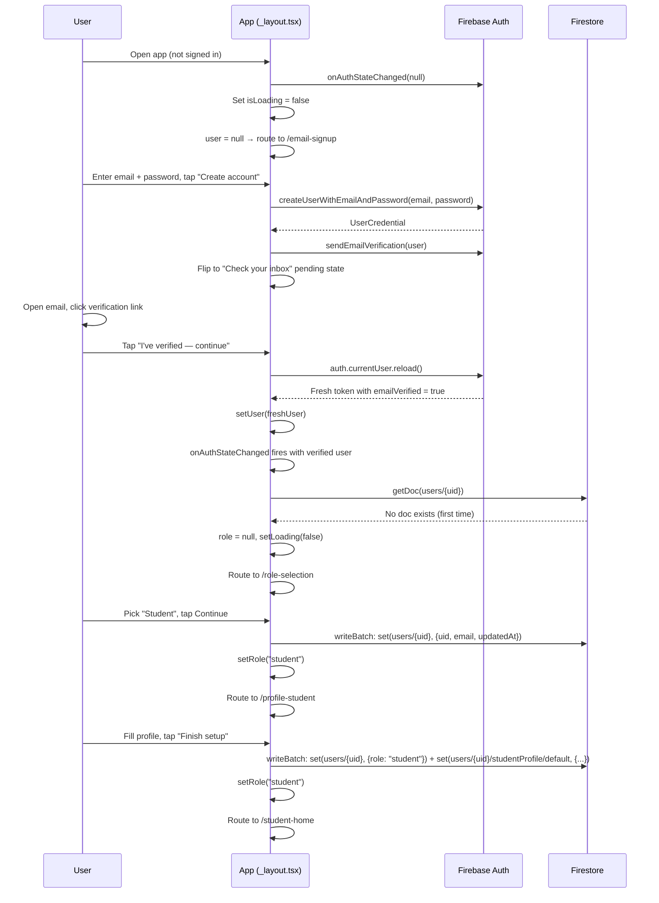
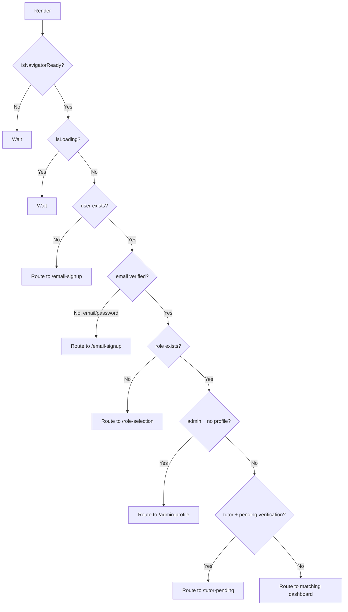
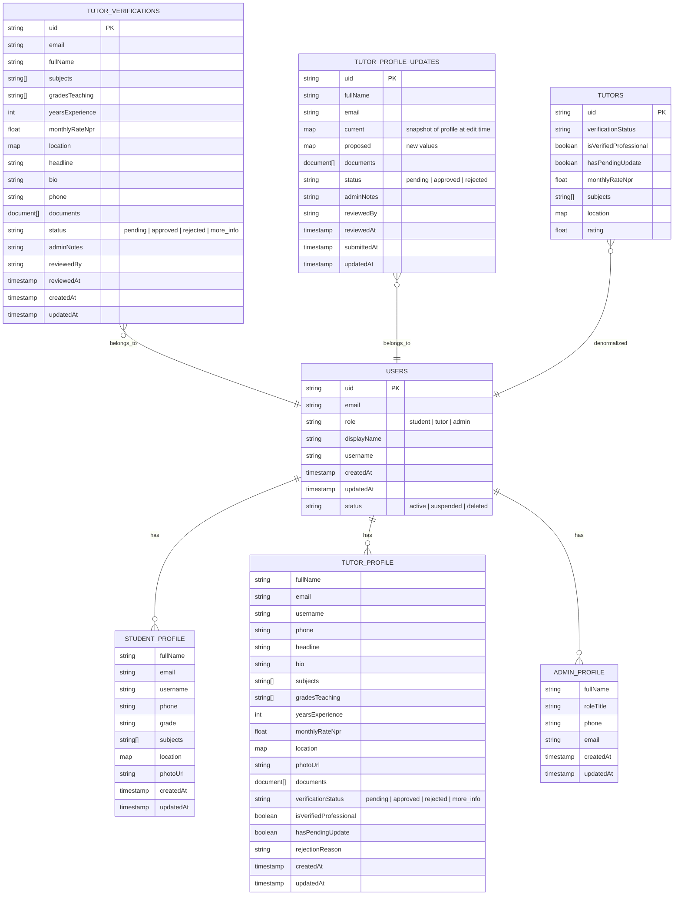
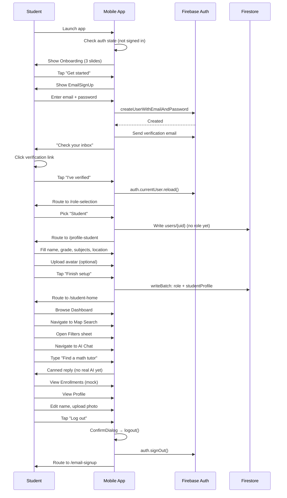
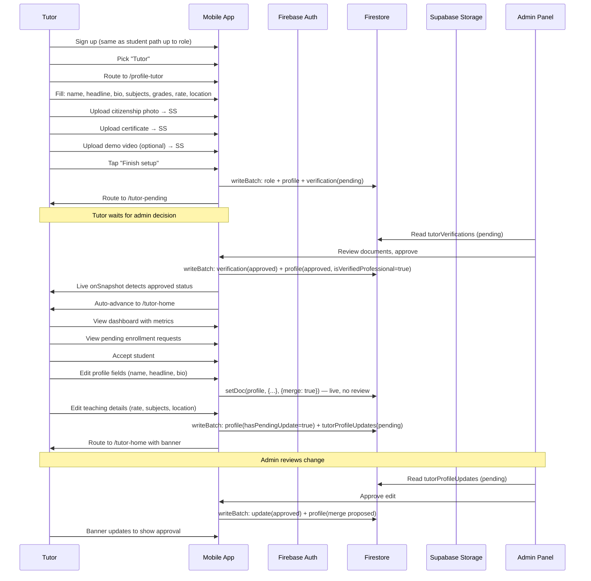
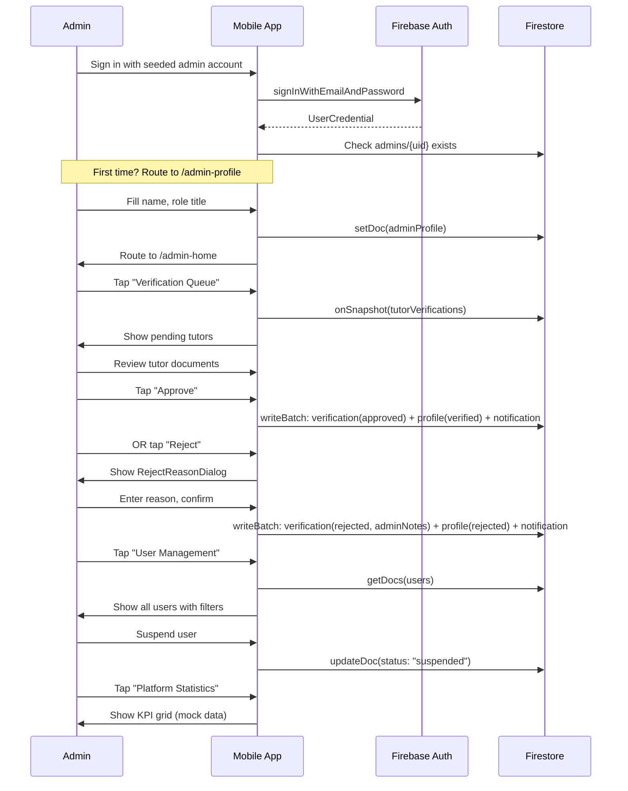
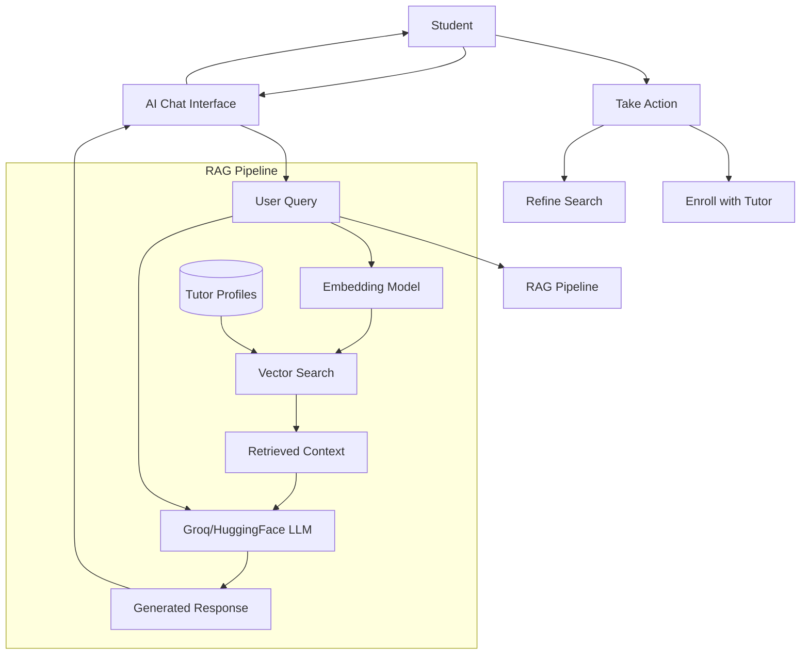
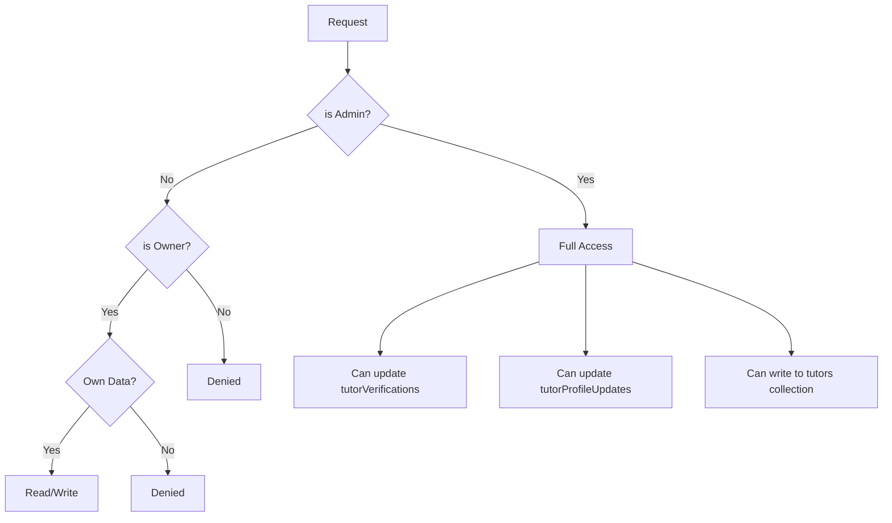
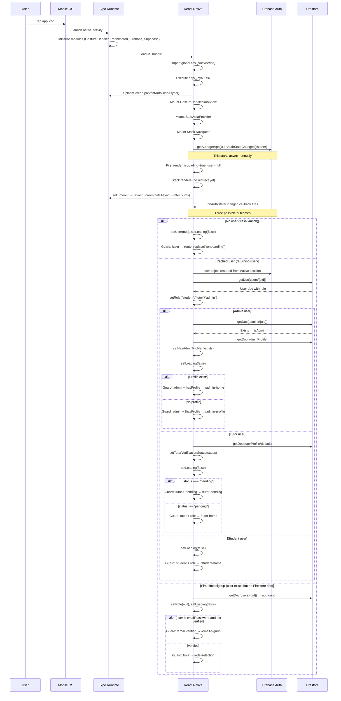
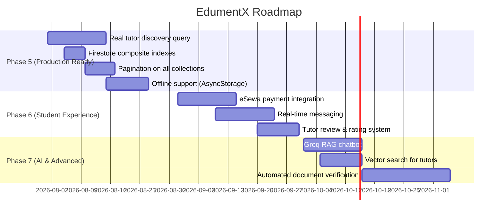

# EdumentX — Project Summary & Study Guide

> **Document version:** 1.0  
> **Last updated:** July 11, 2026  
> **Purpose:** Comprehensive technical documentation for mid-term project defense

---

## Table of Contents

1. [High-Level Project Overview](#part-1--high-level-project-overview)
2. [Folder Structure](#part-2--folder-structure)
3. [Screen-by-Screen Walkthrough](#part-3--screen-by-screen-walkthrough)
4. [Authentication Flow](#part-4--authentication-flow)
5. [Firestore Database](#part-5--firestore-database)
6. [Supabase Storage](#part-6--supabase-storage)
7. [State Management](#part-7--state-management)
8. [Backend Logic](#part-8--backend-logic)
9. [Complete User Workflows](#part-9--complete-user-workflows)
10. [AI Components](#part-10--ai-components)
11. [Navigation Architecture](#part-11--navigation-architecture)
12. [UI Architecture](#part-12--ui-architecture)
13. [Security Model](#part-13--security-model)
14. [Application Startup Flow](#part-14--application-startup-flow)
15. [Mid-Term Defense Preparation](#part-15--mid-term-defense-preparation)
16. [Architecture Review](#part-16--architecture-review)

---

## Part 1 – High-Level Project Overview

### Project Objective

EdumentX is a **home tutoring marketplace** for the Kathmandu Valley, Nepal. It connects **students/parents** with **verified home tutors** through a map-based discovery interface, an AI-powered recommendation engine, and a document-based tutor verification pipeline.

### Problem Statement

In Nepal's education system, finding a reliable home tutor is a trust-intensive process:
- **No centralized platform** exists for tutor discovery
- **Verification is ad-hoc** — parents have no way to verify credentials
- **Pricing is opaque** — no standardized rate cards
- **Scheduling is manual** — coordination happens over phone calls

EdumentX solves this by providing a structured platform where:
1. Tutors submit identity and academic documents for verification
2. Admins review and approve/reject submissions
3. Students discover verified tutors on an interactive map
4. An AI assistant helps match students to the right tutor

### Target Users

| User Role | Description | Primary Actions |
|-----------|-------------|-----------------|
| **Student / Parent** | Learners seeking home tutoring | Search tutors, view map, chat with AI assistant, enroll in sessions |
| **Tutor** | Verified home tutors | Submit verification documents, manage availability, accept students, create batches |
| **Admin** | Platform moderation team | Review tutor verifications, manage users, view platform statistics |

### Major Features

| Feature | Phase | Status |
|---------|-------|--------|
| Email + Password Authentication | Phase 2 | ✅ Complete |
| Google Sign-In | Phase 2 | ✅ Complete |
| Role Selection (Student / Tutor) | Phase 2 | ✅ Complete |
| Student Profile Setup | Phase 2 | ✅ Complete |
| Tutor Profile Setup with Documents | Phase 3 | ✅ Complete |
| Tutor Verification Queue (Admin) | Phase 3 | ✅ Complete |
| Student Dashboard | Phase 4 | ✅ Complete |
| Tutor Dashboard | Phase 4 | ✅ Complete |
| Map Search (UI) | Phase 4 | ✅ Complete |
| AI Chat Assistant (UI only) | Phase 4 | ✅ Complete |
| Enrollments (Mock) | Phase 4 | ✅ Complete |
| Notification Center | Phase 4 | ✅ Complete |
| Admin Profile & User Management | Phase 4 | ✅ Complete |
| Tutor Edit Profile (Live & Reviewed) | Mid-term | ✅ Complete |
| Tutor Resubmission Flow | Mid-term | ✅ Complete |
| Real Tutor Discovery (Firestore) | Phase 5 | ⏳ Pending |
| Real AI RAG (Groq/HuggingFace) | Phase 7 | ⏳ Pending |
| Payment Integration (eSewa) | Phase 7 | ⏳ Pending |
| Real-time Messaging | Phase 7 | ⏳ Pending |

### Overall Architecture

```
┌─────────────────────────────────────────────────────────────────┐
│                    React Native / Expo SDK 54                     │
│                       (TypeScript + NativeWind)                    │
├─────────────────────────────────────────────────────────────────┤
│                                                                    │
│  ┌─────────────────────────────────────────────────────────────┐ │
│  │                   Expo Router (File-based)                    │ │
│  │              Stack Navigator (No Tab Navigator)               │ │
│  └─────────────────────────────────────────────────────────────┘ │
│                                                                    │
│  ┌──────────────┐  ┌──────────────┐  ┌──────────────────────┐   │
│  │  Screens/     │  │  Components/ │  │  Store (Zustand)     │   │
│  │  Auth         │  │  UI/         │  │  authStore.ts        │   │
│  │  Student      │  │  Forms/      │  │                      │   │
│  │  Tutor        │  │  Shared/     │  │                      │   │
│  │  Admin        │  │  Illustrations│  │                      │   │
│  └──────────────┘  └──────────────┘  └──────────────────────┘   │
│                                                                    │
│  ┌─────────────────────────────────────────────────────────────┐ │
│  │                   Service Layer                               │ │
│  │  ┌──────────────┐  ┌──────────────┐  ┌──────────────────┐  │ │
│  │  │  Firebase     │  │  Supabase    │  │  Lib/            │  │ │
│  │  │  AuthService  │  │  Storage     │  │  Verification    │  │ │
│  │  │  Firestore    │  │  Client.ts   │  │  Documents.ts    │  │ │
│  │  └──────────────┘  └──────────────┘  │  EditableFields  │  │ │
│  │                                       │  Discovery.ts    │  │ │
│  │                                       │  Notifications.ts│  │ │
│  │                                       └──────────────────┘  │ │
│  └─────────────────────────────────────────────────────────────┘ │
│                                                                    │
└─────────────────────────────────────────────────────────────────┘
        │                    │                    │
        ▼                    ▼                    ▼
┌──────────────┐    ┌──────────────┐    ┌──────────────────┐
│  Firebase    │    │  Firebase    │    │  Supabase         │
│  Auth        │    │  Firestore   │    │  Storage          │
│  (Identity)  │    │  (Database)  │    │  (Files/Media)    │
└──────────────┘    └──────────────┘    └──────────────────┘
```

### Technology Stack

| Technology | Purpose | Why Chosen |
|-----------|---------|------------|
| **React Native 0.81** | Cross-platform mobile framework | Single codebase for iOS + Android |
| **Expo SDK 54** | Build toolchain & managed workflow | Faster development, no native build setup |
| **TypeScript** | Type safety | Catch errors at compile time |
| **NativeWind (Tailwind CSS)** | Styling | Utility-first, consistent design system |
| **Expo Router (File-based routing)** | Navigation | Familiar web-like routing, deep linking support |
| **Firebase Auth** | Authentication | Free tier (Spark plan), email + Google Sign-In |
| **Firebase Firestore** | Database | Real-time sync, free tier, noSQL document model |
| **Supabase Storage** | File storage | Free tier (1 GB), no credit card required |
| **Zustand** | State management | Lightweight, simple API, no boilerplate |
| **React Native Gesture Handler** | Touch handling | Native performance |
| **React Native Reanimated 4** | Animations | UI thread animations |
| **Lucide React Native** | Icons (Tutor surfaces) | Clean, modern icon set |
| **@expo/vector-icons (Ionicons)** | Icons (Student/Admin) | Wide icon selection, already included |
| **Expo Video** | Video playback | In-app demo video preview for admins |
| **Three.js / @react-three/fiber** | 3D illustrations | Premium onboarding visual experience |

### External Services

| Service | Free Tier | Usage | Credit Card Required |
|---------|-----------|-------|---------------------|
| **Firebase Auth** | Spark plan (free) | Email/Password, Google Sign-In | ❌ No |
| **Firebase Firestore** | Spark plan (1 GiB stored, 10 GiB/month) | All app data | ❌ No |
| **Supabase Storage** | 1 GB storage, 1 GB bandwidth/month | Avatar images, verification documents | ❌ No |
| **OpenStreetMap** | Completely free | Map tiles via `<UrlTile>` (no API key) | ❌ No |
| **Nominatim** | Keyless, rate-limited | Geocoding (free tier) | ❌ No |
| **Groq / HuggingFace** | Free dev tier | RAG Chatbot (Phase 7) | ❌ No |

> **Zero-Budget Principle:** All services were selected specifically because they do not require an international credit card. This project is a college demo built on the free tier.

---

## Part 2 – Folder Structure

```
EdumentX/
├── app/                        # Expo Router file-based routes
│   ├── _layout.tsx             # Root layout — auth guard, navigation setup
│   ├── index.tsx               # App entry (redirects to /onboarding or /email-signup)
│   ├── onboarding.tsx          # Splash → Onboarding carousel → Auth
│   ├── email-signup.tsx        # Auth entry (Login/Signup + Google)
│   ├── role-selection.tsx      # Role pick (Student / Tutor)
│   ├── profile-student.tsx     # Student profile setup
│   ├── profile-tutor.tsx       # Tutor profile setup (with documents)
│   ├── student-home.tsx        # Student dashboard
│   ├── tutor-home.tsx          # Tutor dashboard
│   ├── admin-home.tsx          # Admin dashboard
│   ├── map-search.tsx          # Student map search
│   ├── AI-chat.tsx             # AI Assistant (UI only)
│   ├── enrollment.tsx          # My Enrollments
│   ├── stu-profile.tsx         # Student Profile tab
│   ├── tutor-inbox.tsx         # Tutor enrollment inbox
│   ├── batches.tsx             # Tutor batch management
│   ├── tutor_edit_profile.tsx  # Tutor profile edit
│   ├── tutor_edit_teaching_details.tsx  # High-risk field edit
│   ├── tutor-pending.tsx       # Under-review screen
│   ├── notification.tsx        # Notification center
│   ├── filters-sheet.tsx       # Map search filters (bottom sheet)
│   ├── platform-statistics.tsx # Admin platform statistics
│   ├── verification-queue.tsx  # Admin verification queue
│   ├── user-management.tsx     # Admin user management
│   └── admin-profile.tsx       # Admin profile setup
│
├── screens/                    # Screen components (referenced by app/ routes)
│   ├── auth/
│   │   ├── EmailSignUp.tsx      # Main auth component
│   │   ├── RoleSelection.tsx    # Role selection
│   │   ├── StudentProfileScreen.tsx  # Student profile form
│   │   └── TutorProfileScreen.tsx    # Tutor profile form
│   ├── onboarding/
│   │   ├── SplashScreen.tsx     # Animated splash
│   │   └── OnboardingScreen.tsx # 3-slide carousel
│   ├── student/
│   │   ├── StudentHome.tsx      # Student dashboard
│   │   ├── MapSearch.tsx        # Map search placeholder
│   │   ├── AIChat.tsx           # AI assistant (UI only)
│   │   ├── Enrollment.tsx       # My enrollments
│   │   ├── StudentProfile.tsx   # Student profile tab
│   │   └── FiltersSheet.tsx     # Bottom-sheet filters
│   ├── tutor/
│   │   ├── tutor_home.tsx       # Tutor dashboard
│   │   ├── tutor_inbox.tsx      # Enrollment requests
│   │   ├── edit_profile.tsx     # Live-edit profile
│   │   ├── EditTeachingDetails.tsx  # High-risk field edit
│   │   ├── PendingReview.tsx    # Under-review screen
│   │   └── batch_creation.tsx   # Batch management
│   ├── admin/
│   │   ├── AdminHome.tsx        # Admin dashboard
│   │   ├── AdminProfile.tsx     # Admin profile setup
│   │   ├── PlatformStatistics.tsx   # Live Firestore count aggregations
│   │   ├── UserManagement.tsx   # User management
│   │   └── VerificationQueue.tsx    # Tutor verification
│   └── shared/
│       └── Notification.tsx     # Notification center
│
├── components/                 # Reusable UI components
│   ├── ui/
│   │   ├── PrimaryButton.tsx    # Primary CTA (3 variants)
│   │   ├── SecondaryButton.tsx  # Secondary/outline buttons
│   │   ├── SearchBar.tsx        # Search input
│   │   ├── Avatar.tsx           # Avatar component
│   │   ├── PaginationDots.tsx   # Onboarding pagination
│   │   ├── ImageViewer.tsx      # Image lightbox
│   │   └── VideoViewer.tsx      # Video player modal
│   ├── forms/
│   │   ├── AvatarUploader.tsx   # Image picker + upload
│   │   ├── AvatarBubble.tsx     # Avatar display
│   │   ├── ChipGroup.tsx        # Multi-select chip group
│   │   ├── ConfirmDialog.tsx    # Confirmation modal
│   │   ├── DocumentUploader.tsx # Verification doc upload
│   │   ├── EditableField.tsx    # Inline edit field
│   │   ├── inputs.ts            # Shared input classes
│   │   ├── LocationField.tsx    # City/neighborhood picker
│   │   ├── MenuRow.tsx          # Settings-style menu row
│   │   └── NameEmailFields.tsx  # Name + Email input pair
│   ├── shared/
│   │   ├── AdminNav.tsx         # Admin bottom nav
│   │   ├── BottomNav.tsx        # Student bottom nav
│   │   └── ReviewBanner.tsx     # Verification status banner
│   ├── illustrations/
│   │   ├── AiMatchIllustration.tsx
│   │   ├── AiOrb3D.tsx
│   │   ├── DiscoverIllustration.tsx
│   │   ├── DiscoverScene3D.tsx
│   │   └── VerifiedIllustration.tsx
│   ├── premium/
│   │   ├── PremiumHero3D.tsx    # 3D container for onboarding
│   │   └── SplashParticleField.tsx  # Animated particles
│   └── TutorBottomBar.tsx       # Tutor bottom navigation
│
├── services/                   # Third-party integrations
│   ├── firebase/
│   │   ├── authService.ts      # Firebase Auth wrapper
│   │   └── errors.ts           # Firebase error formatter
│   └── supabase/
│       ├── client.ts           # Supabase client singleton
│       └── storage.ts          # File upload helpers
│
├── store/
│   ├── authStore.ts            # Zustand auth store
│   └── README.md
│
├── lib/
│   ├── registration.ts         # Registration state shim
│   ├── mock/
│   │   └── tutors.ts           # 12 mock tutor profiles
│   └── verification/
│       ├── discovery.ts        # Tutor discovery filter
│       ├── documents.ts        # Document pick + upload
│       ├── editableFields.ts   # Live vs. reviewed fields
│       └── notifications.ts    # Notification templates
│
├── constants/
│   ├── colors.ts               # Raw hex colors (illustrations only)
│   └── theme.ts                # Design tokens as JS
│
├── data/
│   ├── adminStats.ts           # Mock admin stats
│   └── mockData.ts             # Mock enrollment data
│
├── types/
│   └── onboarding.ts           # Onboarding type definitions
│
├── firebase/
│   ├── firestore.rules         # Security rules
│   ├── firestore.indexes.json  # Composite indexes
│   └── storage.rules           # Storage rules (unused — Supabase)
│
├── scripts/
│   └── seedAdmin.ts            # Admin seed script
│
├── tailwind.config.js          # NativeWind design tokens
├── CLAUDE.md                   # AI assistant directives
├── app.json                    # Expo configuration
├── tsconfig.json               # TypeScript configuration
├── babel.config.js             # Babel + NativeWind
├── metro.config.js             # Metro bundler
├── package.json                # Dependencies
└── global.css                  # Global styles
```

### Key Architectural Decisions

**Why screens in `screens/` AND routes in `app/`?**
- Expo Router expects route files in `app/`
- The actual screen components live in `screens/` for clean separation
- `app/*.tsx` files are thin wrappers: `export default function Route() { return <ScreenComponent />; }`

**Why not use tab navigators?**
- Expo Router's Stack navigator + custom bottom nav components (`BottomNav`, `AdminNav`, `TutorBottomBar`) give full control over tab behavior
- Using `router.replace()` (not `navigate()`) prevents stack growth
- Custom nav bars allow varying tab sets by role

---

## Part 3 – Screen-by-Screen Walkthrough

### Authentication Screens

#### `app/email-signup.tsx` → `screens/auth/EmailSignUp.tsx`

| Aspect | Details |
|--------|---------|
| **Purpose** | Single auth entry — handles signup, login, Google Sign-In |
| **Navigation** | Entry point for unauthenticated users. Routes to `/role-selection` after verification |
| **Firestore** | None (authentication is Firebase Auth, not Firestore) |
| **Supabase** | None |
| **Components** | `PrimaryButton`, `Ionicons` |
| **State** | Local: `mode` (signup/login), `email`, `password`, `pendingEmail` |
| **Validation** | Email regex, password length >= 6 |
| **Error Handling** | `formatFirebaseError()` maps error codes to messages. `authErrorSuggestsModeFlip()` auto-flips between signup/login |
| **Loading** | `isSubmitting`, `isGoogleLoading`, `isResending`, `isCheckingVerified` |

**Key states:**
1. **Form state** — email + password inputs + Google button
2. **Pending state** — "Check your inbox" after signup. User must click email link then tap "I've verified — continue" which calls `auth.currentUser.reload()`

#### `app/role-selection.tsx` → `screens/auth/RoleSelection.tsx`

| Aspect | Details |
|--------|---------|
| **Purpose** | Pick Student or Tutor role |
| **Navigation** | From `/email-signup` (after verification). Routes to `/profile-student` or `/profile-tutor` |
| **Firestore** | Writes `users/{uid}` doc with uid, email, displayName. **Does NOT write role** — role is written by the profile setup screen |
| **Supabase** | None |
| **Components** | `PrimaryButton`, `RoleCard` (inline Ionicons-based) |
| **State** | Local: `role`, `isSaving`. Auth store: `setRole`, `setHasExistingRole` |
| **Error Handling** | Catches Firestore errors, shows Alert with error code |

**Design decision:** Role is NOT written here — it's written atomically with the profile in `TutorProfileScreen.handleSubmit`. This prevents the bug where a user picks "Tutor" but closes the app mid-setup, leaving `users/{uid}.role = "tutor"` without a profile.

### Onboarding Screens

#### `screens/onboarding/SplashScreen.tsx`

- Animated splash with Reanimated 4
- Logo tile, "EdumentX" wordmark, tagline
- Progress bar sweeps 0→100% over 1.4s
- 24-particle ambient field (`SplashParticleField`) behind everything
- Auto-hides after splash → navigates to `/onboarding`

#### `screens/onboarding/OnboardingScreen.tsx`

- 3-slide carousel with 3D illustrations
- Slide 1: "Discover tutors on the map" (`DiscoverScene3D`)
- Slide 2: "Ask AI for the best match" (`AiOrb3D`)
- Slide 3: "Verified, trusted tutors" (`VerifiedIllustration` - SVG)
- Pagination dots with spring animation
- "Skip" jumps to `/email-signup`, "Get started" on last slide routes to `/email-signup`

### Student Screens

#### `screens/student/StudentHome.tsx`

- Live Firestore `onSnapshot` reads `users/{uid}` and `users/{uid}/studentProfile/default`
- Greeting resolves: profile.fullName → displayName → email local part → "there"
- Location label from profile
- Search bar (UI only, no backend)
- Empty state — tutor discovery is Phase 5
- Logout with Alert confirmation
- `BottomNav` at bottom

#### `screens/student/MapSearch.tsx`

- Live `expo-maps` native map with clustered teardrop/avatar pins
- Search bar + filter button (opens `FiltersSheet` as inline Modal)
- GPS default camera + Nepal bounds lock; horizontal nearby-tutor carousel
- `BottomNav` at bottom

#### `screens/student/AIChat.tsx`

- Chat UI with message bubbles
- Quick chips for common queries
- Naive keyword router (`cannedReply()`) — no real AI backend
- "Thinking..." indicator with 1.1s delay
- `BottomNav` at bottom

#### `screens/student/Enrollment.tsx`

- Three tabs: Active / Pending / Past
- Live Firestore via `subscribeEnrollmentsByStudent` / `subscribeRequestsByStudent`
- Rate & Review opens the review modal (writes `reviews/{tutorUid}/reviews`)
- Message tutor navigates to `/chat` (1:1 messaging — `services/messages/`)

#### `screens/student/StudentProfile.tsx`

- Avatar (upload to Supabase), name, email, phone
- Live Firestore read on mount
- Editable fields via `EditableField` component
- Notifications row → routes to `/notification`
- Menu rows (Saved tutors, Payment methods) remain "Coming soon" placeholders
- Logout via `ConfirmDialog` overlay
- `BottomNav` at bottom

#### `screens/student/FiltersSheet.tsx`

- Modal bottom-sheet, rendered inline by MapSearch
- Animated slide-up with drag-to-dismiss
- Filter sections: Subject, Level, Class mode, Distance, Budget, Verification
- Custom range sliders (no external dependency)
- Reset + Show results buttons using `SecondaryButton` and `PrimaryButton`

### Tutor Screens

#### `screens/tutor/tutor_home.tsx`

- Live Firestore `onSnapshot` of `users/{uid}/tutorProfile/default`
- 2×2 metric grid (Active students, Rating, Pending requests, Monthly earnings)
- Capacity bar with color thresholds
- Profile completion bar
- Today's sessions (derived live from the roster via `deriveTodaySessions`)
- Pending enrollment requests (live subscription, filtered to pending)
- Group batch CTA → `/batches`; quick actions → inbox/batches/availability/messages
- `ReviewBanner` shows at top when verification is pending/rejected/more_info
- Availability toggle backed by `tutors/{uid}.isAvailableForNewStudents`
- `TutorBottomBar` at bottom

#### `screens/tutor/tutor_inbox.tsx`

- Pending enrollment request cards
- Expandable/collapsible cards
- Accept/Decline/Counter-offer actions
- Map preview placeholder
- `TutorBottomBar` at bottom

#### `screens/tutor/edit_profile.tsx` (`/tutor_edit_profile`)

- The tutor's account/profile edit screen
- Live-editable fields: fullName, headline, bio, photoUrl (no admin review needed)
- Avatar upload to Supabase
- "Teaching details" row → routes to `/tutor_edit_teaching_details` (high-risk fields)
- Verification documents list (read-only, tap to route to edit screen)
- Verification banners: pending/rejected/more_info
- Resubmit button when rejected
- Logout via `ConfirmDialog`
- `TutorBottomBar` at bottom

#### `screens/tutor/EditTeachingDetails.tsx` (`/tutor_edit_teaching_details`)

- High-risk field editing: subjects, grades, monthly rate, location, documents
- Changes go through `tutorProfileUpdates/{uid}` for admin re-review
- 3-way writeBatch on save: profile doc + update doc + user doc
- Diff helpers compare current vs proposed values
- Discard navigates back with no writes

#### `screens/tutor/PendingReview.tsx` (`/tutor-pending`)

- Appears when `verificationStatus === "pending"`
- Static "What we're checking" list
- Contact support (mailto: link)
- Live `onSnapshot` watches for admin decision — auto-advances to `/tutor-home` on approval
- Sign out with inline confirmation dialog

### Admin Screens

#### `screens/admin/AdminHome.tsx`

- Three section cards: Platform Statistics, Verification Queue, User Management
- Live display name from Firestore `onSnapshot`; live active/suspended user counts
- `AdminNav` at bottom

#### `screens/admin/VerificationQueue.tsx`

- **The most complex screen in the app** (~600+ lines)
- Four sections: New Verifications, Pending Edits, Info Requested, Decided
- Live `onSnapshot` on `tutorVerifications` collection
- Approve / Reject (with reason dialog) / Request More Info actions
- Pending edit cards with diff view (old vs new values)
- Document thumbnails with in-app ImageViewerModal and VideoViewerModal
- `writeBatch` commits: flip verification doc + mirror flags to profile doc + write notification
- `checkResubmissions()` promotes rejected/more_info entries back to pending when tutor resubmits
- `enrichMissingAvatars()` backfills photoUrl from profile doc

#### `screens/admin/UserManagement.tsx`

- Fetches all users from Firestore `users` collection
- Status filters: All / Active / Suspended / Deleted
- Role filters: All / Student / Tutor / Admin
- Search bar
- Suspend/Reinstate action
- Soft Delete with confirmation dialog
- Dev fallback to mock data when Firestore read fails

---

## Part 4 – Authentication Flow

### Authentication Architecture



### Auth Methods

| Method | Flow | Email Verification | Spark Plan |
|--------|------|--------------------|------------|
| **Email + Password** | `createUserWithEmailAndPassword` → send verification email → user clicks link → `reload()` | Required | ✅ Free |
| **Google Sign-In** | `GoogleSignin.signIn()` → `signInWithCredential(googleCredential)` | Auto-verified by Google | ✅ Free |
| **Phone OTP** | Removed (requires Blaze plan) | N/A | ❌ Removed |

### Authentication Context

The app does **not** use React Context for auth. Instead, it uses:
- **Zustand store** (`store/authStore.ts`) — holds `user`, `role`, `isLoading`
- **Firebase `onAuthStateChanged`** — subscribed in `app/_layout.tsx`
- **No Context provider** — the Zustand store is consumed directly by screens

### Route Protection

The routing guard in `app/_layout.tsx` runs on every render where `user`/`role`/`segments` change:



### Session Persistence

- Firebase Auth handles session persistence natively via native modules
- On app restart, the SDK restores the session automatically
- The `onAuthStateChanged` callback fires with the cached user

### Logout Flow

1. User taps "Log out" → `ConfirmDialog` overlay (not native Alert)
2. Confirm → `authService.logout()` → clears Firebase session
3. `useAuthStore.getState().reset()` → clears Zustand store
4. `router.replace("/email-signup")` → redirects to auth screen
5. `onAuthStateChanged(null)` fires → layout guard shows `/email-signup`

---

## Part 5 – Firestore Database

### Collections Overview



### Document Relationships

| Collection | Parent | Write Authority | Read Authority |
|------------|--------|----------------|----------------|
| `users/{uid}` | Root | Owner, Admin | Owner, Admin |
| `users/{uid}/studentProfile/default` | users | Owner, Admin | Owner, Admin |
| `users/{uid}/tutorProfile/default` | users | Owner, Admin | Owner, Admin |
| `users/{uid}/adminProfile/default` | users | Owner, Admin | Owner, Admin |
| `tutorVerifications/{uid}` | Root (parallel) | Owner (create), Admin (update) | Owner, Admin |
| `tutorProfileUpdates/{uid}` | Root (parallel) | Owner (create), Admin (update) | Owner, Admin |
| `tutors/{uid}` | Root (parallel) | Admin only | Owner, Admin |
| `admins/{uid}` | Root (parallel) | Server only (seed script) | Owner |
| `notifications/{uid}/{autoId}` | Root | Admin (create), Owner (read/update) | Owner, Admin |

### Write Patterns

**Atomic profile submission (TutorProfileScreen):**
```typescript
const batch = writeBatch(db);
batch.set(userRef, { uid, email, role: "tutor", updatedAt: now }, { merge: true });
batch.set(profileRef, { fullName, subjects, ...documents, verificationStatus: "pending" }, { merge: true });
batch.set(verificationRef, { uid, fullName, ...documents, status: "pending" }, { merge: true });
await batch.commit();
```

**Admin decision (VerificationQueue):**
```typescript
const batch = writeBatch(db);
batch.update(verificationRef, { status: "approved", reviewedBy: admin.uid, reviewedAt: serverTimestamp() });
batch.set(profileRef, { verificationStatus: "approved", isVerifiedProfessional: true }, { merge: true });
await batch.commit();
```

## Part 6 – Supabase Storage

### Bucket Structure

| Bucket | Purpose | Read Access | Write Access | File Cap |
|--------|---------|------------|-------------|----------|
| `public-avatars` | Profile photos | Public | Owner (anon key + RLS) | 5 MB |
| `private-verification-docs` | Tutoring documents | Public (workaround) | Owner (validated by uid) | 25 MB |

### Upload Workflow

```
User picks image → expo-image-picker → local URI
    ↓
Read bytes via expo-file-system File.arrayBuffer()
    ↓
Upload to Supabase via getSupabase().storage.from(bucket).upload(path, bytes, { upsert: true })
    ↓
Return { publicUrl, path }
    ↓
Persist URL to Firestore profile doc
```

### Why Supabase Instead of Firebase Storage?

- Firebase Storage requires a credit card to even access the dashboard (even on Spark plan)
- Supabase Storage offers 1 GB free with no credit card requirement
- The public bucket approach (using anon key + RLS) avoids needing signed URLs (which would require Cloud Functions on a paid plan)

### Current Limitation: Public Reads on "Private" Bucket

The `private-verification-docs` bucket has public read enabled because:
- The free Supabase tier has no Cloud Functions to generate signed URLs
- The admin queue needs to render document thumbnails
- Writes are still owner-only (enforced by upload function calling with user's uid)
- **Future improvement:** Add signed URLs once Cloud Functions are available

---

## Part 7 – State Management

### Zustand Auth Store

```typescript
interface AuthState {
  user: FirebaseAuthTypes.User | null;
  role: UserRole; // 'student' | 'tutor' | 'admin' | null
  hasAdminProfile: boolean;
  hasExistingRole: boolean;
  tutorVerificationStatus: TutorVerificationStatus; // 'pending' | 'approved' | 'rejected' | 'more_info' | null
  isLoading: boolean;
  
  // Setters
  setUser: (user) => void;
  setRole: (role) => void;
  setHasAdminProfile: (flag) => void;
  setHasExistingRole: (flag) => void;
  setTutorVerificationStatus: (status) => void;
  setLoading: (loading) => void;
  reset: () => void;
}
```

### State Flow During Authentication

```
App Launch → isLoading=true
    ↓
onAuthStateChanged fires → isLoading=false, user=User|null
    ↓
If user exists → read users/{uid} from Firestore
    ↓
Set role, hasAdminProfile, tutorVerificationStatus → isLoading=false
    ↓
Layout guard reads store → routes to appropriate screen
```

### Local State Patterns

| Pattern | Used For | Example |
|---------|----------|---------|
| `useState` | Form inputs, UI state | Email, password, selected role |
| `useRef` | Mutable values that shouldn't trigger re-render | `lastUidRef`, `navLockRef` |
| `useMemo` | Derived data | Filter lists in VerificationQueue |
| `useEffect` | Side effects, subscriptions | `onSnapshot`, `onAuthStateChanged` |
| Module-level mutable state | Temporary cross-screen data | `lib/registration.ts` shim |

---

## Part 8 – Backend Logic

### Firebase Auth Service (`services/firebase/authService.ts`)

| Function | Input | Output | Description |
|----------|-------|--------|-------------|
| `signUpWithEmail` | email, password | UserCredential | Creates account + sends verification email |
| `loginWithEmail` | email, password | UserCredential | Signs in with existing credentials |
| `sendVerificationAgain` | (none — uses currentUser) | void | Re-sends verification email |
| `signInWithGoogle` | (none) | UserCredential | Google Sign-In via play services |
| `logout` | (none) | void | Signs out of Firebase Auth |

### Firebase Error Service (`services/firebase/errors.ts`)

- Maps Firebase error codes to user-friendly messages
- `authErrorSuggestsModeFlip()` detects when user is on wrong auth mode (signup vs login) and suggests switching

### Supabase Client (`services/supabase/client.ts`)

- Singleton pattern — prevents socket leaks under hot reload
- Lazy initialization — fails loudly with descriptive error if env vars missing
- `persistSession: false` — we don't use Supabase Auth

### Supabase Storage (`services/supabase/storage.ts`)

| Function | Input | Output | Description |
|----------|-------|--------|-------------|
| `uploadAvatar` | uid, uri | { publicUrl, path } | Uploads profile photo, overwrites if exists |
| `uploadVerificationDoc` | uid, kind, uri | { path } | Uploads document with path `{uid}/{kind}.{ext}` |
| `getVerificationDocPublicUrl` | path | string | Returns public URL for a stored file |

### Firestore Rules (`firebase/firestore.rules`)

Key rule functions:
- `isSignedIn()` — checks `request.auth != null`
- `isOwner(userId)` — checks `request.auth.uid == userId`
- `isAdmin()` — checks `admins/{uid}` exists OR `users/{uid}.role == "admin"`

Notable rules:
- `users/{userId}/{subcollection}/{document=**}` — owner OR admin can read/write
- `tutorVerifications/{uid}` — owner can create with `status: "pending"`, owner can update ONLY when transitioning from `rejected`/`more_info` to `pending`, admin can always update
- `notifications/{uid}` — admin can create, owner can only update `read`/`readAt` fields

---

## Part 9 – Complete User Workflows

### Student Workflow



### Tutor Workflow



### Admin Workflow



---

## Part 10 – AI Components

### Current State (Phase 4)

The AI Chat in `screens/student/AIChat.tsx` is a **UI-only preview** with:

- Chat interface with message bubbles
- Quick chips for common queries
- A naive keyword router (`cannedReply()`) that returns pre-written responses
- Simulated 1.1s "thinking" delay

### Planned AI Architecture (Phase 7)



| Component | Technology | Status |
|-----------|-----------|--------|
| Chat UI | React Native | ✅ Complete |
| Keyword Router | Naive JS | ✅ Complete (placeholder) |
| RAG Pipeline | Groq / HuggingFace | ⏳ Phase 7 |
| Embeddings | To be decided | ⏳ Phase 7 |
| Vector Search | To be decided | ⏳ Phase 7 |

---

## Part 11 – Navigation Architecture

### Route Structure

```
Root Stack (Expo Router)
├── / (index.tsx)
├── /onboarding
├── /email-signup              # Auth entry
├── /role-selection            # Role pick
├── /profile-student           # Student profile setup
├── /profile-tutor             # Tutor profile setup
├── /student-home              # Student dashboard
│   └── (BottomNav routes)
│       ├── /map-search        # Map search
│       ├── /AI-chat           # AI assistant
│       ├── /enrollment        # Enrollments
│       ├── /stu-profile       # Student profile tab
│       └── /notification      # Notification center
├── /tutor-home                # Tutor dashboard
│   └── (TutorBottomBar routes)
│       ├── /tutor-inbox       # Enrollment inbox
│       ├── /batches           # Batch management
│       ├── /tutor_edit_profile       # Profile edit
│       └── /tutor_edit_teaching_details  # High-risk edit
├── /tutor-pending             # Under review
├── /admin-home                # Admin dashboard
│   └── (AdminNav routes)
│       ├── /platform-statistics
│       ├── /verification-queue
│       ├── /user-management
│       └── /admin-profile
└── /filters-sheet             # (Used as Modal, not route)
```

### Navigation Patterns

| Pattern | Implementation | Usage |
|---------|---------------|-------|
| **Stack (root)** | Expo Router `<Stack>` | Top-level route groups |
| **Bottom Nav** | Custom components (`BottomNav`, `AdminNav`, `TutorBottomBar`) mounted at screen level | Tab switching within role |
| **Modal** | React Native `<Modal>` | FiltersSheet, ConfirmDialog, RejectReasonDialog |
| **Router.replace()** | `router.replace(path)` | Tab switching, auth redirects (prevents back-stack growth) |
| **Router.push()** | `router.push(path)` | Forward navigation (e.g. notification → detail) |
| **router.back()** | `router.back()` | Discard navigation |

### Navigation Lock

The auth guard uses a `navLockRef` pattern to prevent overlapping `router.replace()` calls:

```typescript
if (navLockRef.current) return;
navLockRef.current = true;
setTimeout(() => { navLockRef.current = false; }, 100);
```

This prevents React Navigation's "configured linking in multiple places" error during rapid guard executions.

---

## Part 12 – UI Architecture

### Design System

| Token Category | Prefix | Example |
|----------------|--------|---------|
| Colors | `bg-`, `text-`, `border-` | `bg-night`, `text-amber`, `border-border` |
| Typography | `text-` | `text-display`, `text-body`, `text-caption` |
| Spacing | `p-`, `m-`, `gap-` | `p-4`, `mt-2`, `gap-3` |
| Sizing | `h-`, `w-`, `min-h-` | `h-btn`, `w-avatar-card`, `min-h-touch` |
| Radius | `rounded-` | `rounded-card`, `rounded-pill` |

### Shared Components

| Component | Variants | States | Size Prop |
|-----------|----------|--------|-----------|
| `PrimaryButton` | `primary` (green), `accent` (amber), `ghost` (surface) | Default, Pressed, Disabled, Loading | `md` (52px), `lg` (56px) |
| `SecondaryButton` | `outline`, `ghost`, `destructive` | Default, Pressed, Disabled | `md` (52px), `sm` (40px) |
| `Avatar` | Default, Tinted by name | Image, Initials fallback | N/A |
| `SearchBar` | Single variant | Focused, Typing, Clear | N/A |
| `PaginationDots` | Animated width | Active, Inactive | N/A |
| `ImageViewer` | Modal lightbox | Image loaded, Error, Loading | N/A |
| `VideoViewer` | Modal player | Playing, Paused, Error | N/A |

### Form Components

| Component | Purpose | States |
|-----------|---------|--------|
| `ChipGroup` | Multi-select chip grid | Selected, Unselected, Error |
| `LocationField` | City/neighborhood picker | Empty, Filled, Searching |
| `DocumentUploader` | File pick + upload | Empty, Has file, Uploading |
| `EditableField` | Inline text edit | View, Edit, Saving |
| `AvatarUploader` | Image pick + preview | Empty, Has image, Uploading |
| `ConfirmDialog` | Confirmation modal | Visibile, Hidden |

### Navigation Bars

| Nav Bar | Role | Tabs | Active Indicator |
|---------|------|------|------------------|
| `BottomNav` | Student | Home, Map, AI, Enrollments, Profile | Green pill + bold text |
| `TutorBottomBar` | Tutor | Dashboard, Inbox, Batches, Profile | Green pillar + colored text |
| `AdminNav` | Admin | Home, Statistics, Verification, Users, Profile | Amber icon + amber |text |

---

## Part 13 – Security Model

### Authentication Security

- **Password hashing**: Handled by Firebase Auth (bcrypt)
- **Session management**: Native Firebase SDK handles tokens
- **Email verification**: Required for email/password accounts
- **Google account**: Auto-verified by Google

### Firestore Security Rules

| Rule | Effect |
|------|--------|
| `users/{userId}`: owner read/write | Users can only read/write their own data |
| `admins/{adminId}`: read only for owner, write blocked | Prevents self-promotion to admin |
| `tutorVerifications/{uid}`: owner create, admin update | Tutors can submit, only admins can decide |
| `tutorProfileUpdates/{uid}`: owner create, admin update | Same model for edit reviews |
| `notifications/{uid}`: admin create, owner update read flag | Users can't fake notifications |
| `tutors/{uid}`: admin write only | Students never write to tutor collection |

### Role-Based Access Control



### Supabase Storage Security

- **Avatar bucket** (`public-avatars`): Public read, write via anon key + RLS by uid
- **Verification docs** (`private-verification-docs`): Public read (temporary workaround), write path validated by including uid in upload path
- **No service-role key on client**: Prevents privilege escalation

### Input Validation

- Client-side validation on all forms (email regex, phone regex, length checks)
- No server-side validation (Firebase/AWS free tier limitations)
- File size limits enforced before upload (4 MB images, 25 MB video)
- MIME type validation before upload

---

## Part 14 – Application Startup Flow



---

## Part 15 – Mid-Term Defense Preparation

### Likely Viva Questions and Answers

#### Architecture & Design Decisions

**Q1: Why did you choose React Native over Flutter?**
> **Answer:** Our team has existing expertise in JavaScript/TypeScript and React. React Native allows us to share code between iOS and Android with a single codebase, which was critical given our small team size and limited timeline. Additionally, Expo's managed workflow eliminated the need for native build tooling setup, letting us focus on features.

**Q2: Why did you use Firebase instead of building your own backend?**
> **Answer:** As a college demo project with zero budget, Firebase provided authentication, a real-time database, and file storage without requiring server infrastructure. Firestore's real-time `onSnapshot` listeners were particularly valuable for features like the live admin queue and dashboard updates. The Spark (free) plan covers our expected usage for the demo.

**Q3: Why Supabase Storage instead of Firebase Storage?**
> **Answer:** Firebase Storage requires a credit card to enable, even on the free tier. Supabase offers 1 GB of storage with no credit card requirement. Since our project operates on a strict zero-budget policy, Supabase was the only viable option.

**Q4: Why did you move from Clerk to Firebase Auth?**
> **Answer:** We initially chose Clerk for its simpler API, but during development, Clerk discontinued its `integration_firebase` template for new accounts. This left us without a supported authentication path. We pivoted to native Firebase Auth (`@react-native-firebase/auth`), which is the officially supported React Native integration and requires no third-party bridge.

**Q5: Why Zustand instead of Redux or Context API?**
> **Answer:** Our auth state is relatively simple — user object, role, and a few flags. Zustand provides a minimal API with no boilerplate (no providers, reducers, or action types). Context API would have caused unnecessary re-renders on every auth state change, and Redux was overkill for our scope. Zustand's `create()` function gives us a lightweight, TypeScript-friendly store.

#### Authentication

**Q6: How does the email verification flow work?**
> **Answer:** When a user signs up with email and password, Firebase sends a verification email via `sendEmailVerification()`. The screen flips to a "Check your inbox" pending state. When the user clicks the link and returns, they tap "I've verified — continue", which calls `auth.currentUser.reload()` to refresh the token claim. The layout guard then sees `emailVerified: true` and advances the user to the role selection screen.

**Q7: What happens if a user tries to log in without verifying their email?**
> **Answer:** If an unverified email/password user logs in, the `_layout.tsx` guard detects `emailVerified === false` and routes them back to `/email-signup`, which shows the "Check your inbox" pending state. They can resend the verification email from there.

**Q8: How does Google Sign-In work, and why are Google users not required to verify their email?**
> **Answer:** Google Sign-In uses `@react-native-google-signin/google-signin` to get an ID token, which is exchanged for a Firebase credential via `signInWithCredential`. Google accounts are inherently verified — Google has already confirmed the email during account creation. The Firebase Auth record has `emailVerified: true` by default for Google users.

**Q9: What is the "Amnesia Login Loop" bug you mentioned in the documentation?**
> **Answer:** The Amnesia Login Loop occurred when an existing user with a populated `users/{uid}.role` signed back in. The `onAuthStateChanged` callback would set the user but the role-fetch from Firestore hadn't completed yet. The layout guard, seeing `role: null`, would route the user to `/role-selection` before the role could be read. The fix was to read the role inside the same async callback as the `onAuthStateChanged` handler and write it to the Zustand store before the redirect effect runs.

#### Firestore & Data Model

**Q10: Explain your Firestore data model and why you chose this schema.**
> **Answer:** We use a root `users/{uid}` document for auth metadata with subcollections for role-specific profiles (`studentProfile`, `tutorProfile`, `adminProfile`). This separates concerns — the root doc is small and frequently read by the auth guard, while profiles are larger documents read less frequently. The `tutorVerifications` collection is a parallel root collection because admins query it across all tutors (not per-user). The `tutorProfileUpdates` collection mirrors this pattern for edit reviews.

**Q11: Why do you denormalize verification status onto the tutor profile doc?**
> **Answer:** The `tutorVerifications/{uid}` doc is the source of truth, but reading it on every layout guard render would add latency. By mirroring `verificationStatus`, `isVerifiedProfessional`, and `hasPendingUpdate` onto `users/{uid}/tutorProfile/default`, the layout guard and tutor dashboard read everything they need from a single doc. Both writes happen in the same `writeBatch`, so they're always atomic.

**Q12: Why don't you use Firestore transactions in the admin queue?**
> **Answer:** The admin queue's approve/reject handlers use `writeBatch` instead of transactions. A batch is sufficient because we're writing to independent documents and no read-then-write dependency exists. Transactions would add latency (requiring a round-trip for locking) without providing additional safety — the batch commits atomically or fails entirely.

**Q13: How do you handle the case where a tutor tries to update a verification doc that has already been approved?**
> **Answer:** The Firestore security rules (`firestore.rules`) explicitly prevent this. The rule `allow update: if (isOwner(uid) && resource.data.status in ["rejected", "more_info"] && request.resource.data.status == "pending")` only allows tutor updates when the current status is "rejected" or "more_info" and the new status is "pending". A tutor cannot update a doc with `status === "approved"` or `status === "pending"`.

#### Tutor Verification

**Q14: Walk me through the complete tutor verification pipeline.**
> **Answer:** 1) Tutor submits profile with documents → `writeBatch` creates `tutorVerifications/{uid}` (status: "pending") + `users/{uid}/tutorProfile/default`. 2) Layout guard detects `tutorVerificationStatus === "pending"` and routes to `/tutor-pending`. 3) Admin reviews in Verification Queue. 4) Admin approves → `writeBatch` flips `tutorVerifications/{uid}.status` to "approved" + mirrors to profile doc. 5) Live `onSnapshot` on `/tutor-pending` detects the change. 6) Tutor is auto-advanced to `/tutor-home`.

**Q15: What happens when a tutor is rejected and wants to resubmit?**
> **Answer:** The tutor sees a rejection reason on their dashboard via `ReviewBanner`. They tap "Resubmit for review" on the edit profile screen, which routes to `/profile-tutor`. The `TutorProfileScreen` form re-runs the same `writeBatch`. The Firestore rules now allow the owner to update `tutorVerifications/{uid}` when transitioning from "rejected" to "pending". The admin queue detects the resubmission via the updated `tutorVerifications` doc with `status: "pending"`.

**Q16: How do you handle profile edits from verified tutors?**
> **Answer:** We split edits into two categories: 1) **Live-editable fields** (fullName, headline, bio, photoUrl) — saved directly to the profile doc without admin review. 2) **High-risk fields** (subjects, rate, location, documents) — submitted to `tutorProfileUpdates/{uid}` with status "pending". The tutor's profile is hidden from search (`hasPendingUpdate: true`) until an admin approves or rejects the change in the Verification Queue.

#### UI & Frontend

**Q17: How do you manage navigation state and prevent routing loops?**
> **Answer:** We use a navigation lock (`navLockRef`) that prevents overlapping `router.replace()` calls. The auth guard effect checks this lock before executing any redirect. We also use `requestAnimationFrame` to ensure the navigator is mounted before calling `router.replace()`. The lock is released via `setTimeout(100ms)` and cancelled on effect cleanup.

**Q18: Why did you choose NativeWind over StyleSheet or Styled Components?**
> **Answer:** NativeWind provides utility-first CSS classes (similar to Tailwind CSS for web) directly in React Native. This gives us a consistent design system through `tailwind.config.js`, eliminates inline style objects, and reduces the chance of visual inconsistencies across screens. The `className` prop approach is familiar to anyone with web development experience.

**Q19: How do you handle the loading state while Firebase Auth initializes?**
> **Answer:** The Zustand store's `isLoading` starts as `true`. While loading, the layout guard returns nothing (short-circuits before any redirect). A loading overlay with `ActivityIndicator` sits above the Stack with `pointerEvents="none"`. Once `onAuthStateChanged` fires and the role is resolved, `setLoading(false)` releases the guard.

**Q20: Explain the 3D illustrations on the onboarding screen.**
> **Answer:** The onboarding screen uses `@react-three/fiber` and `three.js` to render 3D scenes inside React Native views. `PremiumHero3D` wraps each scene in a container with a colored background. `DiscoverScene3D` shows a map-like scene, `AiOrb3D` shows a floating orb with particles, and `VerifiedIllustration` is an SVG (not 3D) for the final slide. The 3D elements add visual impact during onboarding.

#### Security

**Q21: How do you prevent unauthorized users from accessing admin screens?**
> **Answer:** At the navigation level, the layout guard in `_layout.tsx` checks the user's role before routing. Only users with `role === "admin"` can access admin routes. At the data level, Firestore rules ensure that only the `isAdmin()` function can write to collections like `tutorVerifications`, `tutorProfileUpdates`, and `tutors`. The admin status is verified by the existence of an `admins/{uid}` document.

**Q22: How do you prevent users from uploading malicious files?**
> **Answer:** We enforce client-side validation: 1) File size limits (4 MB for images, 25 MB for video). 2) MIME type validation via extension sniffing. 3) The Supabase RLS policy restricts writes to the owner's path (uid prefix). We also decode the file bytes through `expo-file-system` rather than trusting the picker's MIME type.

**Q23: What prevents a student from impersonating a tutor?**
> **Answer:** The Firestore rules enforce ownership — `isOwner(userId)` checks `request.auth.uid == userId`. A student cannot write to a tutor's `users/{uid}` doc or create a `tutorVerifications/{uid}` doc for another user. Additionally, role is assigned atomically with profile submission in `TutorProfileScreen.handleSubmit`.

#### Performance

**Q24: How do you handle Firestore read costs on the free tier?**
> **Answer:** We minimize reads by: 1) Using `onSnapshot` listeners that only fire on data changes (not polling). 2) Denormalizing verification status onto profile docs to avoid cross-collection reads. 3) Using the auth guard to short-circuit reads for unauthenticated users. The Spark plan's 50,000 reads/day is sufficient for our demo scale.

**Q25: Why don't you use pagination for the admin queue?**
> **Answer:** For the demo, the `tutorVerifications` collection is expected to have tens (not thousands) of documents. We read all docs and partition client-side by status. This simplifies the code and avoids composite index requirements. If the collection grows, we'd switch to `where` queries per section with pagination.

**Q26: How do you handle image caching for avatars?**
> **Answer:** We append a cache-buster query parameter (`?t=${Date.now()}`) to the Supabase public URL every time the avatar is re-uploaded. This forces React Native's `<Image>` component to re-fetch instead of serving a cached version of the previous avatar. The `uploadedAt` timestamp from the document record is also used for verification doc cache-busting.

#### Deployment & Testing

**Q27: How do you deploy your app?**
> **Answer:** We use EAS Build (Expo Application Services) to create native builds. The Android build is distributed as an APK/AAB file. Firebase rules are deployed via the Firebase CLI (`firebase deploy --only firestore:rules`). Supabase schema changes are managed through the Supabase Dashboard. There is no CI/CD pipeline yet — deployments are manual.

**Q28: How do you test your application?**
> **Answer:** Currently, testing is manual through emulator runs and physical device testing. We have no automated unit tests or E2E tests. The `npx tsc --noEmit` command provides TypeScript type-checking. ESLint provides code quality checks. This is a known area for improvement.

**Q29: How do you seed admin accounts?**
> **Answer:** We have a `scripts/seedAdmin.ts` script that uses the Firebase Admin SDK to create an admin document in Firestore (`admins/{uid}`). The script is run manually from a developer machine with valid Firebase service account credentials. Admin accounts cannot be created from the client app — this prevents self-promotion.

#### Project Management

**Q30: How did you organize development into phases?**
> **Answer:** We followed a phased approach: Phase 1 (Onboarding), Phase 2 (Authentication — email/password + Google), Phase 3 (Tutor verification pipeline), Phase 4 (Dashboards — student, tutor, admin), and mid-term deliverables (edit flows, resubmission, admin profile). Each phase built on the previous one, with authentication being the foundation.

**Q31: What was the most challenging bug you encountered?**
> **Answer:** The "Resubmit Cache Bug" — when a rejected tutor resubmitted their profile, the admin queue kept showing the old documents and fields. The root cause was two-fold: First, the code detected an existing `tutorVerifications` doc and skipped the write (to avoid a `permission-denied` from the security rules). Second, the security rules explicitly prevented owner updates. The fix required both changing the security rules to allow owner updates for rejected → pending transitions AND removing the skip guard in `TutorProfileScreen`.

**Q32: What would you do differently if you started over?**
> **Answer:** 1) Use Firebase Auth from the start (avoid the Clerk pivot). 2) Write automated tests earlier — especially for the routing guard logic. 3) Design the Firestore schema with a clearer separation between profile docs and verification docs. 4) Use Zod or a similar library for runtime validation of Firestore document shapes.

### Additional Viva Questions (Q33–50)

**Q33:** How does the `hasExistingRole` flag work, and why is it needed?
> **Answer:** It distinguishes returning users (role read from Firestore) from first-time users (role set locally by RoleSelection). The profile screen Back button uses it to decide whether to route to the dashboard (returning) or clear the role and go back to role-selection (first-time).

**Q34:** Why do you write `uid` to the Firestore user doc?
> **Answer:** The Firestore rules check `request.resource.data.uid == userId`. Without the `uid` field on the document, this check fails and blocks updates. The `_layout.tsx` heal block backfills missing `uid` fields on existing docs.

**Q35:** Explain the document cache workaround in the tutor edit flow.
> **Answer:** When a tutor re-uploads a document (e.g., a new citizenship scan), the upload goes to Supabase immediately but the Firestore write only happens on "Save changes". If the user discards, the orphaned file stays on Supabase — but since it's never referenced by any Firestore doc, it's effectively garbage. This is acceptable for the demo.

**Q36:** How does the FiltersSheet communicate with the MapSearch screen?
> **Answer:** The FiltersSheet is rendered as a Modal inside MapSearch, not as a separate route. Both components share the MapSearch's state. When the user taps "Show results", the sheet calls `onClose()` — MapSearch is responsible for reading the filter state and applying it (currently a no-op since the backend isn't wired).

**Q37:** Why don't you use `expo-document-picker` for document uploads?
> **Answer:** The spec calls for "clear photo of certificate" — a JPEG/PNG photo, not a PDF scan. `expo-image-picker` covers both camera captures and gallery picks and is already a project dependency. Using `expo-document-picker` would add a second picker dependency for a use case the user hasn't asked for.

**Q38:** How do you handle the case where a user's email is already registered?
> **Answer:** The Firebase Auth error `auth/email-already-in-use` is caught by the `handleSubmit` function. The `authErrorSuggestsModeFlip()` helper detects this and automatically switches the UI from "Sign up" to "Log in" mode, showing an alert explaining the switch.

**Q39:** Explain the difference between `router.replace()` and `router.push()`.
> **Answer:** `replace()` swaps the current screen in the navigation stack — the previous screen is removed and can't be reached with the back button. `push()` adds a new screen on top of the stack. We use `replace()` for tab switching and auth redirects to prevent stack growth and back-navigation to intermediate states.

**Q40:** How does the `onSnapshot` listener on the pending review screen work?
> **Answer:** When a tutor is on `/tutor-pending`, the screen subscribes to `onSnapshot` on their `users/{uid}/tutorProfile/default` doc. When the admin approves, the snapshot fires with the updated `verificationStatus: "approved"`. The handler mirrors this to the Zustand store and calls `router.replace("/tutor-home")`. The layout guard sees the updated store value and doesn't bounce back to pending.

**Q41:** Why is the splash screen important for your app?
> **Answer:** The splash screen uses Reanimated 4 animations (scale, opacity, translateY) on the UI thread, providing a smooth transition while Firebase Auth initializes in the background. It prevents the user from seeing a blank screen or flash of unauthenticated content.

**Q42:** How do you handle the "New Architecture" (`newArchEnabled: true`) in app.json?
> **Answer:** Expo SDK 54 enables Fabric (the new React Native architecture) by default. This required updating native modules to be Fabric-compatible. The `react-native-css-interop: 0.2.5` override in package.json was needed for NativeWind compatibility with the new architecture.

**Q43:** What are the limitations of using the Spark (free) Firebase plan?
> **Answer:** No Cloud Functions (can't run server-side code). Limited Firestore quotas (50K reads/day, 20K writes/day, 20K deletes/day). No Firebase Cloud Storage (requires card verification). 100 simultaneous connections. No SMS provider (can't use phone auth).

**Q44:** Explain the "ReviewBanner" component and its three tones.
> **Answer:** ReviewBanner is a shared component that displays verification status to tutors. Three tones: 1) `pending` (amber) — "Under review". 2) `info` (blue) — "More info requested". 3) `rejected` (red) — "Submission rejected". The banner surfaces at the top of the tutor dashboard, above the metrics grid.

**Q45:** How do you handle navigation when the root navigator hasn't mounted yet?
> **Answer:** The `useRootNavigationState()` hook provides `navState.key`, which is `null` until the Stack navigator mounts. The guard checks `isNavigatorReady` before any `router.replace()` call. Additionally, a `requestAnimationFrame` wrapper ensures the navigator has published its `key` before navigation executes.

**Q46:** Why do you have separate bottom nav components for each role?
> **Answer:** The Student, Tutor, and Admin nav bars have different tab sets and different visual languages (green for student, amber for admin). Rather than creating a single over-engineered "nav factory", we create separate components. This is clear, type-safe, and easy to modify per role.

**Q47:** How does the "Discard" button work in the edit teaching details screen?
> **Answer:** The Discard button simply calls `router.back()` with NO Firestore writes. The `documents` Map (in-memory state) is discarded. Any files uploaded to Supabase during the session are orphaned — they exist on storage but are never referenced by a Firestore doc. This is acceptable for the demo.

**Q48:** What is the `registration.ts` module, and why is it temporary?
> **Answer:** It's a module-level state shim that holds the profile draft during multi-step signup. It's a temporary replacement for what will eventually be a Zustand store with AsyncStorage persistence (Phase 4). The current shim is enough to pass draft fields between screens without dropping data on navigation.

**Q49:** How do you ensure atomicity when writing to multiple Firestore documents?
> **Answer:** We use `writeBatch` for all multi-document writes. A batch commits all writes atomically — either all succeed or none succeed. There is no partial failure state. This is used in profile submission (users doc + profile doc + verification doc), admin decisions (verification doc + profile doc + notification), and edit submission.

**Q50:** What is your backup and disaster recovery plan?
> **Answer:** Firestore data is automatically backed up by Google Cloud. Supabase Storage files are managed through Supabase's dashboard. Our codebase is version-controlled with Git (GitHub). There is no automated backup for Supabase data currently — manual exports would be needed.

### Quick Reference: Key Numbers

| Metric | Value |
|--------|-------|
| Screens | 20+ |
| Shared Components | 15+ |
| Firestore Collections | 8 |
| Firestore Subcollections | 3 |
| Firebase Auth Methods | 2 (Email/Password, Google) |
| External Services | 3 (Firebase, Supabase, OSM) |
| Mock Tutors | 12 |
| Tutor Doc Types | 3 (citizenship, certificate, demo) |
| Onboarding Slides | 3 |
| Student Subjects | 7 |
| Tutor Subjects | 7 (teaching) |
| Tutor Grades | 9 levels |
| Admin Tabs | 5 |
| Dependencies | ~40 packages |

---

## Part 16 – Architecture Review

### Current Strengths

| Area | Strength |
|------|----------|
| **Architecture** | Clean separation of concerns: routes → screens → components → services |
| **Authentication** | Two reliable free methods (email + Google) |
| **Real-time updates** | Firestore `onSnapshot` for live dashboard and admin queue |
| **Zero-budget compliance** | All services selected for free-tier availability |
| **TypeScript** | Full type safety across the codebase |
| **UI consistency** | NativeWind design tokens in `tailwind.config.js` |
| **Documentation** | Comprehensive code comments in every file |

### Weaknesses

| Area | Weakness | Improvement |
|------|----------|-------------|
| **Testing** | No automated tests | Add Jest + React Native Testing Library |
| **Error recovery** | Limited offline support | Add local caching for Firestore reads |
| **Performance** | No pagination on collections | Add Firestore pagination for user list |
| **State management** | No persistent cache | Replace registration.ts with Zustand + AsyncStorage |
| **Security** | Verification doc bucket is public read | Add signed URLs via Cloud Function |
| **CI/CD** | No automated builds | Set up EAS Build with GitHub Actions |
| **Monitoring** | No error tracking | Add Sentry or similar crash reporting |

### Performance

| Concern | Current State | Recommendation |
|---------|---------------|----------------|
| Firestore reads | Un-paginated reads | Add `limit()` + cursor-based pagination |
| Bundle size | ~30 MB APK | Enable Hermes, tree-shake unused deps |
| Image loading | No lazy loading | Add `expo-image` for cached image loading |
| Animations | Reanimated 4 on UI thread | ✅ Already optimal |
| Re-renders | No memoization | Add `React.memo` and `useCallback` on heavy lists |

### Scalability

| Scenario | Current Limit | Scaling Strategy |
|----------|---------------|------------------|
| Users | 100 simultaneous (Spark limit) | Upgrade to Blaze plan |
| Documents | 50K reads/day | Implement pagination, reduce listener frequency |
| Storage | 1 GB | Compress images more aggressively |
| Real-time listeners | 100 concurrent | Use single listener + client-side filtering |

### Security Gaps

| Issue | Severity | Mitigation |
|-------|----------|------------|
| Public read on verification docs | Medium | Add signed URLs when Cloud Functions are available |
| No rate limiting on auth | Low | Firebase Auth has built-in rate limiting |
| Client-side validation only | Medium | Add server-side validation via Firestore rules `has()` checks |
| No CAPTCHA on signup | Low | Add Firebase App Check |

### Future Improvement Roadmap



---

*End of document. Generated July 11, 2026 for EdumentX mid-term defense preparation.*
