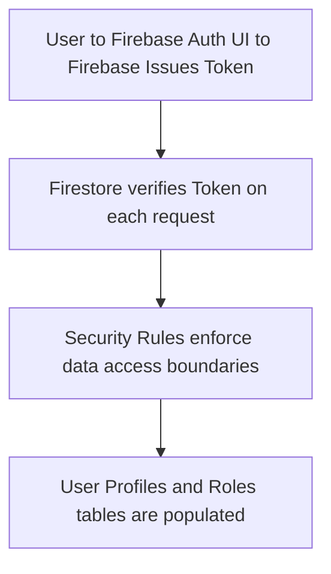
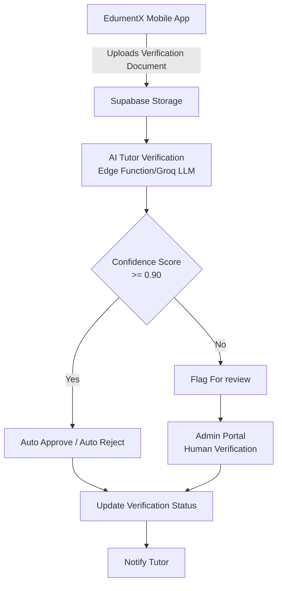
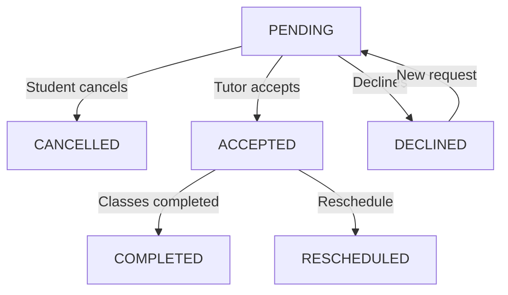
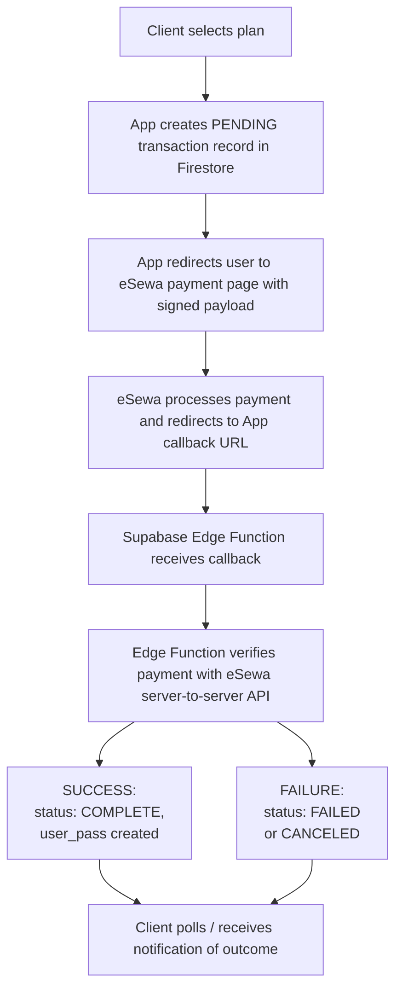

# EdumentX Workflow Diagrams (Mermaid format)

You can copy and paste the code blocks below into any Mermaid live editor (like https://mermaid.live/) to generate high-quality images. Once you download the images (e.g., as PNG files), you can place them in your `Images` folder and replace the placeholders in the report.

## 1. Authentication and Onboarding Workflow (Figure 3.1)

## 2. Architecture of Tutor Verification Process (Figure 3.2)

## 3. Enrollment Request Status Lifecycle (Figure 3.3)

## 4. eSewa Payment Transaction Flow (Figure 3.4)

