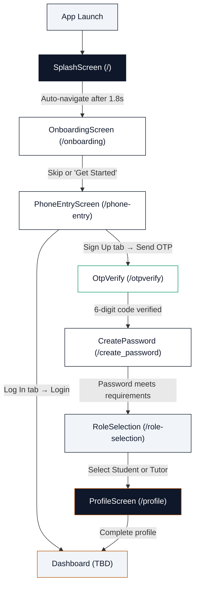

# EdumentX — Comprehensive Project Analysis & Design Guide

> **Document Purpose**: Single-source-of-truth reference for AI models, Figma Make design tool, and developers. Covers the full project architecture, every screen's exact layout and behavior, the design system with precise token values, Firebase integration, and actionable improvement suggestions.
>
> **Generated**: June 2026 | **Project Phase**: Early Development (Auth + Onboarding UI)  
> **Last verified against**: Actual codebase source files (not older documentation)

---

## Table of Contents

1. [Project Overview](#1-project-overview)
2. [Technology Stack & Dependencies](#2-technology-stack--dependencies)
3. [Project Architecture & File Structure](#3-project-architecture--file-structure)
4. [Design System & Tokens (Exact Values)](#4-design-system--tokens-exact-values)
5. [Navigation & User Flow](#5-navigation--user-flow)
6. [Screen-by-Screen Analysis](#6-screen-by-screen-analysis)
7. [Firebase Backend Architecture](#7-firebase-backend-architecture)
8. [Current Implementation Status](#8-current-implementation-status)
9. [Design Improvement Suggestions](#9-design-improvement-suggestions)
10. [Workflow & Architecture Improvements](#10-workflow--architecture-improvements)
11. [Figma Make Design Guide](#11-figma-make-design-guide)
12. [AI Model Context Cheat Sheet](#12-ai-model-context-cheat-sheet)

---

## 1. Project Overview

### What is EdumentX?

**EdumentX** is a **location-based tutor finding mobile app** built with **React Native (Expo)** and **Firebase**. It connects **Students/Parents** with **verified home Tutors**, featuring AI-powered matching, map-based tutor discovery, and a trust system with "Blue Tick Pro" verified tutors.

> [!IMPORTANT]
> The app is NOT a generic e-learning platform. It's specifically a **tutor marketplace** focused on **in-person home tutoring** with **location-based discovery**.

### Core Value Proposition

| Role | Key Features |
|------|-------------|
| **Student / Parent** | Find verified home tutors on a map, filter by distance/subject/rating, manage enrollments |
| **Tutor** | List teaching services, receive enrollment requests, get document-verified "Blue Tick" status |
| **Admin** (future) | Verify tutors, manage users, oversee platform operations |

### Project Metadata

| Property | Value |
|----------|-------|
| **App Name** | EdumentX |
| **Slug** | `edumentx` |
| **SDK** | Expo SDK 54 |
| **React** | 19.1.0 |
| **React Native** | 0.81.5 |
| **Platform** | iOS & Android (managed workflow, new architecture enabled) |
| **Scheme** | `edumentx` |
| **Orientation** | Portrait-locked |
| **Node Version** | ≥20.19.4 (via `.nvmrc` and `engines`) |
| **License** | GNU GPL v3 |
| **Repository** | Private (SuhanVerse/EdumentX) |
| **UI Style** | Automatic (supports light/dark but currently light-focused) |

---

## 2. Technology Stack & Dependencies

### Core Framework (from actual `package.json`)

```json
{
  "expo": "~54.0.33",
  "react": "19.1.0",
  "react-native": "0.81.5",
  "expo-router": "~6.0.23",
  "typescript": "~5.9.2"
}
```

### Navigation & UI

```json
{
  "expo-router": "~6.0.23",
  "react-native-gesture-handler": "~2.28.0",
  "react-native-safe-area-context": "~5.6.0",
  "react-native-screens": "~4.16.0",
  "@expo/vector-icons": "^15.0.3"
}
```

### Media & System

```json
{
  "expo-image-picker": "~17.0.11",
  "expo-linking": "~8.0.11",
  "expo-splash-screen": "~31.0.13",
  "expo-status-bar": "~3.0.9"
}
```

### Web Support

```json
{
  "react-dom": "19.1.0",
  "react-native-web": "~0.21.0"
}
```

### Dev Dependencies

```json
{
  "typescript": "~5.9.2",
  "@types/react": "~19.1.0",
  "eslint": "^9.25.0",
  "eslint-config-expo": "~10.0.0",
  "prettier": "^3.8.3"
}
```

### Experimental Features Enabled

```json
{
  "newArchEnabled": true,
  "typedRoutes": true,
  "reactCompiler": true
}
```

### Environment Variables Required

```env
EXPO_PUBLIC_FIREBASE_API_KEY=
EXPO_PUBLIC_FIREBASE_AUTH_DOMAIN=
EXPO_PUBLIC_FIREBASE_PROJECT_ID=
EXPO_PUBLIC_FIREBASE_STORAGE_BUCKET=
EXPO_PUBLIC_FIREBASE_MESSAGING_SENDER_ID=
EXPO_PUBLIC_FIREBASE_APP_ID=
EXPO_PUBLIC_GOOGLE_MAPS_API_KEY=
EXPO_PUBLIC_APP_ENV=development
```

### NPM Scripts

```json
{
  "start": "expo start",
  "android": "expo start --android",
  "ios": "expo start --ios",
  "web": "expo start --web",
  "lint": "eslint .",
  "typecheck": "tsc --noEmit"
}
```

---

## 3. Project Architecture & File Structure

### Directory Tree (Accurate)

```
EdumentX/
├── app/                          # Expo Router v6 - Thin route wrappers
│   ├── _layout.tsx               # Root layout (Stack + SafeArea + GestureHandler)
│   ├── index.tsx                 # Entry → SplashScreen + auto-nav timer
│   ├── onboarding.tsx            # Route → OnboardingScreen
│   ├── phone-entry.tsx           # Route → PhoneEntryScreen
│   ├── otpverify.tsx             # Route → OtpVerify
│   ├── create_password.tsx       # Route → CreatePassword
│   ├── role-selection.tsx        # Route → RoleSelectionScreen
│   └── profile.tsx               # Route → ProfileScreen
│
├── screens/                      # Screen components (full UI + logic)
│   ├── auth/
│   │   ├── PhoneEntryScreen.tsx   # Phone input + signup/login toggle
│   │   ├── OtpVerify.tsx         # 6-digit OTP with auto-advance
│   │   ├── Password.tsx          # Password creation + strength meter
│   │   ├── RoleSelection.tsx     # Student/Tutor picker (2 roles)
│   │   └── ProfileScreen.tsx     # Profile: name, email, grade, subject, avatar
│   └── onboarding/
│       ├── SplashScreen.tsx      # Branded splash with progress bar
│       └── OnboardingScreen.tsx  # 3 feature slides with icons
│
├── components/                   # Reusable UI components
│   └── forms/                    # (Empty - planned for extraction)
│
├── constants/                    # Design tokens & theming
│   ├── colors.ts                 # Re-exports from theme.ts
│   ├── spacing.ts                # Re-exports from theme.ts
│   ├── typography.ts             # Re-exports + overrides from theme.ts
│   └── theme.ts                  # ★ MASTER theme file (single source of truth)
│
├── services/                     # Backend service integrations
│   └── firebase/                 # (Empty - planned)
│
├── firebase/                     # Firebase config & rules
│   ├── firestore.rules           # Firestore security rules
│   ├── storage.rules             # Storage security rules
│   └── indexes.json              # Firestore indexes (empty)
│
├── Documentation/                # Project docs & design assets
│
├── package.json                  # Dependencies & scripts
├── app.json                      # Expo configuration
├── tsconfig.json                 # TypeScript config (strict, @/* paths)
├── firebase.json                 # Firebase emulator config
├── .env.example                  # Required environment variables
└── .gitignore                    # Git ignore rules
```

### Architecture Pattern

```
┌──────────────────────────────────────────────────┐
│           app/ (Expo Router v6)                  │
│  Thin route wrappers → import screen components  │
│  Each file = 1 default export wrapping a screen  │
├──────────────────────────────────────────────────┤
│           screens/ (Screen Components)           │
│  Full UI + local state + business logic          │
│  Each screen is a self-contained component       │
├──────────────────────────────────────────────────┤
│           components/ (Reusable UI)              │
│  Currently empty, planned for extraction         │
├──────────────────────────────────────────────────┤
│        constants/ (Design Tokens)                │
│  theme.ts = master, others re-export subsets     │
├──────────────────────────────────────────────────┤
│          services/ (Backend APIs)                │
│  Currently empty, planned for Firebase services  │
└──────────────────────────────────────────────────┘
```

### Path Aliases

```json
// tsconfig.json
{
  "compilerOptions": {
    "paths": {
      "@/*": ["./*"]
    }
  }
}
```

All imports use `@/` prefix: `@/screens/auth/OtpVerify`, `@/constants/colors`, etc.

---

## 4. Design System & Tokens (Exact Values)

> [!IMPORTANT]
> The design system uses a **LIGHT theme** with a professional, minimal aesthetic. The master file is `constants/theme.ts`. Other files (`colors.ts`, `spacing.ts`, `typography.ts`) re-export subsets.

### 4.1 Color Palette

#### Brand Colors

| Token | Hex Value | Description |
|-------|-----------|-------------|
| `brand.primary` | `#0F172A` | **Night Slate** — Primary brand, buttons, text |
| `brand.primaryDark` | `#020617` | Darker variant |
| `brand.primaryLight` | `#F1F5F9` | **Sand** — Light backgrounds, icon circles |
| `brand.accent` | `#B45309` | **Polished Copper** — CTA accent (Profile "Finish" button) |
| `brand.verification` | `#059669` | **Forest Emerald** — Verified tutor badges |
| `brand.verificationDark` | `#065F46` | Dark emerald |
| `brand.verificationLight` | `#ECFDF5` | Light emerald tint |
| `brand.ai` | `#4F46E5` | **Indigo** — AI feature accent |
| `brand.aiDark` | `#312E81` | Dark indigo |
| `brand.aiLight` | `#EEF2FF` | Light indigo tint |
| `brand.aiBorder` | `#C7D2FE` | AI border accent |
| `brand.splash` | `#0F172A` | Splash screen background (same as primary) |
| `brand.splashText` | `#F1F5F9` | Splash text color |
| `brand.splashTrack` | `rgba(241, 245, 249, 0.12)` | Splash progress bar track |
| `brand.primaryBorder` | `#E2E8F0` | Primary border color |

#### Semantic Colors

| Token | Hex | Text | Background |
|-------|-----|------|------------|
| `success` | `#059669` | `#064E3B` | `#DCFCE7` |
| `warning` | `#D97706` | `#92400E` | `#FEF3C7` |
| `danger` | `#DC2626` | `#7F1D1D` | `#FEE2E2` |
| `info` | `#0F172A` | — | `#F1F5F9` |

#### Background Colors

| Token | Hex | Usage |
|-------|-----|-------|
| `background.page` | `#F1F5F9` | **Sand** — Page background |
| `background.adminPage` | `#F8FAFC` | Admin page background |
| `background.surface` | `#FFFFFF` | Card/surface backgrounds |
| `background.disabled` | `#F1F5F9` | Disabled state background |

#### Text Colors

| Token | Hex/Value | Usage |
|-------|-----------|-------|
| `text.primary` | `#0F172A` | **Night** — Headings, primary text |
| `text.secondary` | `#475569` | Descriptions, subtitles |
| `text.tertiary` | `#1E293B` | Less prominent text |
| `text.muted` | `#94A3B8` | Placeholders, disabled text |
| `text.disabled` | `#CBD5E1` | Disabled controls |
| `text.inverse` | `#FFFFFF` | Text on dark backgrounds |
| `text.link` | `#B45309` | **Copper** link color |

#### Border Colors

| Token | Value | Usage |
|-------|-------|-------|
| `border.default` | `#E2E8F0` | Default borders |
| `border.strong` | `#94A3B8` | Prominent borders |
| `border.subtle` | `rgba(15, 23, 42, 0.04)` | Subtle card borders |
| `border.card` | `rgba(15, 23, 42, 0.06)` | Card outlines |

#### Onboarding-Specific Colors

| Token | Hex | Usage |
|-------|-----|-------|
| `onboarding.mapBackground` | `#F1F5F9` | Slide 1 (Map/location) background |
| `onboarding.aiBackground` | `#EEF2FF` | Slide 2 (AI match) background |
| `onboarding.verifyBackground` | `#ECFDF5` | Slide 3 (Verified tutors) background |

### 4.2 Typography Scale (Actual Values)

| Token | Size | Line Height | Weight | Extra |
|-------|------|-------------|--------|-------|
| `brandTitle` | 30px | 36px | 500 (Medium) | — |
| `heroTitle` | 28px | 34px | 500 (Medium) | Screen headings |
| `screenTitle` | 22px | 29px | 500 (Medium) | — |
| `sectionTitle` | 15px | 22px | 500 (Medium) | — |
| `cardTitle` | 14px | 20px | 500 (Medium) | — |
| `body` | 13px | 20px | 400 (Regular) | — |
| `bodySmall` | 12px | 18px | 400 (Regular) | — |
| `caption` | 11px | 15px | 400 (Regular) | — |
| `micro` | 10px | 13px | 500 (Medium) | — |
| `overline` | 11px | 15px | 500 (Medium) | letterSpacing: 0.6, UPPERCASE |
| `button` | 14px | 20px | 500 (Medium) | — |
| `buttonSmall` | 13px | 18px | 500 (Medium) | — |
| `sessionCode` | 32px | 32px | 500 (Medium) | letterSpacing: 5 |

> **Note**: The typography exported from `typography.ts` has some overrides:
> - `body`: 14px / 20px (overridden from theme's 13px)
> - `onboardingBody`: 15px / 24px (custom for onboarding subtitles)
> - `caption`: 12px / 18px (overridden from theme's 11px)

### 4.3 Spacing Scale (Actual Values)

| Theme Token | Value | Exported As |
|-------------|-------|-------------|
| `xxs` | 2px | — |
| `xs` | 4px | `spacing.xs` |
| `s` | 6px | — |
| `sm` | 8px | `spacing.sm` |
| `md` | 10px | — |
| `lg` | 12px | `spacing.md` |
| `xl` | 14px | — |
| `page` | 16px | `spacing.page` |
| `section` | 18px | — |
| `screen` | 20px | `spacing.lg` |
| `xxl` | 22px | — |
| `xxxl` | 24px | `spacing.xl` |
| `huge` | 32px | `spacing.xxl` |

> [!WARNING]
> The spacing export aliases are **confusingly remapped**. For example, `spacing.md` = `theme.spacing.lg` (12px), and `spacing.lg` = `theme.spacing.screen` (20px). Always reference the pixel values directly.

### 4.4 Border Radius

| Token | Value | Usage |
|-------|-------|-------|
| `radii.xs` | 6px | Small elements |
| `radii.sm` | 8px | Chips, small cards |
| `radii.md` | 10px | Inputs, buttons |
| `radii.card` | 12px | Cards, primary buttons |
| `radii.lg` | 14px | Role cards |
| `radii.hero` | 18px | Hero sections |
| `radii.circle` | 999px | Circles, pills |

### 4.5 Component Size Tokens

| Token | Value | Usage |
|-------|-------|-------|
| `sizes.touchTarget` | 44px | Minimum tap target |
| `sizes.inputHeight` | 48px | Standard input height |
| `sizes.inputHeightLarge` | 52px | Large input height |
| `sizes.primaryButtonHeight` | 52px | Primary CTA button height |
| `sizes.compactButtonHeight` | 40px | Compact button height |
| `sizes.bottomNavHeight` | 64px | Bottom navigation bar |
| `sizes.avatarSmall` | 40px | Small avatar |
| `sizes.avatarCard` | 60px | Card-size avatar |
| `sizes.otpBoxWidth` | 44px | OTP digit box width |
| `sizes.otpBoxHeight` | 52px | OTP digit box height |

### 4.6 Component Presets

```typescript
components: {
  card: {
    backgroundColor: '#FFFFFF',
    borderColor: '#E5E7EB',
    borderRadius: 12,
    borderWidth: StyleSheet.hairlineWidth,
    padding: 16,
  },
  input: {
    backgroundColor: '#FFFFFF',
    borderColor: '#E5E7EB',
    borderRadius: 10,
    borderWidth: StyleSheet.hairlineWidth,
    minHeight: 48,
    paddingHorizontal: 12,
  },
  primaryButton: {
    backgroundColor: '#0F172A',
    borderRadius: 12,
    minHeight: 52,
  },
  secondaryButton: {
    backgroundColor: '#F1F5F9',
    borderRadius: 10,
    minHeight: 44,
  },
  segmentedRail: {
    backgroundColor: '#F1F5F9',
    borderRadius: 999,
    padding: 4,
  },
}
```

### 4.7 Badge Styles

| Badge | Background | Text Color |
|-------|-----------|------------|
| Active / Verified / Approved | `#DCFCE7` | `#059669` |
| Pending | `#FEF3C7` | `#D97706` |
| Past | `#F1F5F9` | `#475569` |
| Info | `#F1F5F9` | `#0F172A` |
| Suspended / Rejected | `#FEE2E2` | `#DC2626` |

---

## 5. Navigation & User Flow

### Complete Authentication Flow



### Root Layout Configuration

```typescript
// app/_layout.tsx
export default function RootLayout() {
  return (
    <GestureHandlerRootView style={{ flex: 1 }}>
      <SafeAreaProvider>
        <Stack screenOptions={{ headerShown: false }}>
          <Stack.Screen name="index" />
          <Stack.Screen name="onboarding" />
          <Stack.Screen name="phone-entry" />
          <Stack.Screen name="otpverify" />
          <Stack.Screen name="create_password" />
          <Stack.Screen name="role-selection" />
          <Stack.Screen name="profile" />
        </Stack>
        <StatusBar style="dark" />
      </SafeAreaProvider>
    </GestureHandlerRootView>
  );
}
```

### Route-to-Screen Mapping

| Route File | Exported Component | Screen Component | URL Path |
|-----------|-------------------|-----------------|----------|
| `app/index.tsx` | `IndexScreen` | `SplashScreen` | `/` |
| `app/onboarding.tsx` | `OnboardingRoute` | `OnboardingScreen` | `/onboarding` |
| `app/phone-entry.tsx` | `PhoneEntryRoute` | `PhoneEntryScreen` | `/phone-entry` |
| `app/otpverify.tsx` | `OtpVerifyRoute` | `OtpVerify` | `/otpverify` |
| `app/create_password.tsx` | `CreatePasswordRoute` | `CreatePassword` | `/create_password` |
| `app/role-selection.tsx` | `RoleSelectionRoute` | `RoleSelectionScreen` | `/role-selection` |
| `app/profile.tsx` | `ProfileRoute` | `ProfileScreen` | `/profile` |

### Navigation Method per Screen

| From Screen | To Screen | Method | Trigger |
|------------|-----------|--------|---------|
| Splash | Onboarding | `router.replace('/onboarding')` | Auto after 1800ms timeout |
| Onboarding | Phone Entry | `router.replace('/phone-entry')` | Skip or "Get Started" |
| Phone Entry | OTP Verify | `router.push({ pathname: '/otpverify', params: { phone } })` | "Send OTP" (signup mode) |
| Phone Entry | Onboarding | `router.replace('/onboarding')` | Back button |
| OTP Verify | Password | `router.push('/create_password')` | "Verify OTP" |
| OTP Verify | Phone Entry | `router.replace('/phone-entry')` | Back button |
| Password | Role Selection | `router.replace('/role-selection')` | "Continue" |
| Role Selection | Profile | `router.push('/profile')` | "Continue" |
| Role Selection | Password | `router.replace('/create_password')` | Back button |
| Profile | Role Selection | `router.replace('/role-selection')` | Back button |

---

## 6. Screen-by-Screen Analysis

### 6.1 Splash Screen

**File**: [SplashScreen.tsx](file:///media/xlegion/Win/PROJECTS/EdumentX/screens/onboarding/SplashScreen.tsx)  
**Route**: `/` (via [index.tsx](file:///media/xlegion/Win/PROJECTS/EdumentX/app/index.tsx))

#### Layout Wireframe

```
┌──────────────────────────────────┐
│       (Dark Night Slate bg)      │
│                                  │
│                                  │
│          ┌──────────┐            │
│          │    E     │  (white    │
│          │          │   box,     │
│          └──────────┘   16px    │
│                          radius) │
│                                  │
│         EdumentX                 │
│   Find your perfect tutor       │
│          nearby                  │
│                                  │
│     [═══════════════]            │
│      (progress bar, 104px wide)  │
│                                  │
│                                  │
└──────────────────────────────────┘
```

#### Technical Specification

| Property | Value |
|----------|-------|
| **Background** | `#0F172A` (Night Slate, solid) |
| **Status Bar** | Light content (white icons) |
| **Logo** | 64×64px white rounded box (`borderRadius: 16`), letter "E" in `#0F172A` (30px, weight 600) |
| **Title** | "EdumentX" — 34px, weight 500, `#FFFFFF`, lineHeight 40 |
| **Subtitle** | "Find your perfect tutor nearby" — 16px, `#F1F5F9`, lineHeight 22 |
| **Progress Bar** | 104px wide, 4px tall, track: `rgba(241,245,249,0.12)`, fill: `#FFFFFF` |
| **Animation** | Progress bar animates from 0% to 100% over 1200ms using `Animated.timing` |
| **Auto-navigation** | `index.tsx` navigates to `/onboarding` after 1800ms via `setTimeout` |
| **No LinearGradient** | Solid color background (unlike older docs) |

---

### 6.2 Onboarding Screen

**File**: [OnboardingScreen.tsx](file:///media/xlegion/Win/PROJECTS/EdumentX/screens/onboarding/OnboardingScreen.tsx)  
**Route**: `/onboarding`

#### Layout Wireframe

```
┌──────────────────────────────────┐
│  (White surface bg)              │
│                         [Skip]   │
│                                  │
│  ┌──────────────────────────┐    │
│  │   (Tinted illustration   │    │
│  │    panel, 280px max-h)   │    │
│  │                          │    │
│  │      ┌──────────┐        │    │
│  │      │  [Icon]  │ 120px  │    │
│  │      │   58px   │ circle │    │
│  │      └──────────┘ white  │    │
│  │                          │    │
│  └──────────────────────────┘    │
│                                  │
│  Discover tutors on the map      │
│  See verified home tutors in     │
│  your neighborhood...            │
│                                  │
│         ● ○ ○  (dots)            │
│                                  │
│  ┌──────────────────────────┐    │
│  │       Next               │    │
│  └──────────────────────────┘    │
└──────────────────────────────────┘
```

#### Slide Data (Exact)

| # | Title | Subtitle | Background | Accent | Icon |
|---|-------|----------|------------|--------|------|
| 1 | "Discover tutors on the map" | "See verified home tutors in your neighborhood - sorted by distance, subject, and rating." | `#F1F5F9` (Sand) | `#0F172A` (Primary) | `location-outline` |
| 2 | "Ask AI for the best match" | "Tell our AI assistant what you need to learn. It recommends the right tutor in seconds." | `#EEF2FF` (AI Purple tint) | `#4F46E5` (Indigo) | `sparkles-outline` |
| 3 | "Verified, trusted tutors" | "Every Blue Tick Pro tutor is document-verified by our team. Your safety, our priority." | `#ECFDF5` (Emerald tint) | `#059669` (Emerald) | `shield-checkmark-outline` |

#### Technical Details

| Property | Value |
|----------|-------|
| **Background** | `#FFFFFF` (Surface white) |
| **Status Bar** | Dark content |
| **Illustration Panel** | Rounded rectangle (`borderRadius: 20`), height = `min(280, max(220, screenWidth * 0.72))` |
| **Icon Circle** | 120×120px, `borderRadius: 999`, white background |
| **Icon** | Ionicons, 58px, colored by slide's `accentColor` |
| **Title** | `heroTitle` (28px, weight 500), color `#0F172A` |
| **Subtitle** | `onboardingBody` (15px/24px), color `#475569` |
| **Skip Button** | Top-right, `body` typography, color `#475569` |
| **Dot Indicators** | Active: 24×8px pill `#0F172A`, Inactive: 8×8px circle `#94A3B8` |
| **Primary Button** | 52px height, `borderRadius: 12`, bg `#0F172A`, text `#FFFFFF` |
| **Button Text** | "Next" (slides 1-2), "Get started" (slide 3) |
| **Navigation** | State-based (no FlatList/swipe) — buttons and dot presses change `activeSlide` state |

---

### 6.3 Phone Entry Screen

**File**: [PhoneEntryScreen.tsx](file:///media/xlegion/Win/PROJECTS/EdumentX/screens/auth/PhoneEntryScreen.tsx)  
**Route**: `/phone-entry`

#### Layout Wireframe

```
┌──────────────────────────────────┐
│  (White surface bg)              │
│  [← Back]                        │
│                                  │
│  Create your account             │
│  (or "Welcome back" in login)    │
│                                  │
│  ┌──────────┬──────────┐         │
│  │ Sign up  │  Log in  │ (tabs)  │
│  └──────────┴──────────┘         │
│                                  │
│  PHONE NUMBER                    │
│  ┌────────┐ ┌──────────────┐     │
│  │NP +977▾│ │ 97XXXXXXXX   │     │
│  └────────┘ └──────────────┘     │
│  (validation hint)               │
│                                  │
│  [Password field - login only]   │
│  [Forgot password? - login only] │
│                                  │
│                                  │
│  ┌──────────────────────────┐    │
│  │     Send OTP / Log in    │    │
│  └──────────────────────────┘    │
│                                  │
│  By continuing, you agree to     │
│  EdumentX's Terms and Privacy    │
│  Policy.                         │
└──────────────────────────────────┘
```

#### Dual-Mode (Sign Up / Log In)

This screen has a **segmented control** that toggles between Sign Up and Log In modes:

| Mode | Fields Shown | CTA Button | Navigation |
|------|-------------|-----------|------------|
| **Sign Up** | Phone number only | "Send OTP" | → `/otpverify` with `{ phone }` param |
| **Log In** | Phone + Password + Forgot | "Log in" | → Alert (Firebase not connected yet) |

#### Technical Details

| Property | Value |
|----------|-------|
| **Background** | `#FFFFFF` (Surface) |
| **Status Bar** | Dark content |
| **Title** | `heroTitle` (28px/500), "Create your account" / "Welcome back" |
| **Segmented Control** | Pill rail bg `#F1F5F9`, active segment bg `#FFFFFF`, `borderRadius: 8-10` |
| **Country Box** | Fixed width 92px, height 52px, displays "NP +977 ▾" (hardcoded Nepal only) |
| **Phone Input** | Flex-fill, 52px height, `borderRadius: 10`, `fontSize: 16` |
| **Phone Validation** | 10 digits required, strips non-digits |
| **Password Field** | Login mode only, 52px height, eye toggle button |
| **Forgot Password** | Right-aligned link, `caption` style, `#0F172A` color |
| **Primary Button** | 52px height, `borderRadius: 12`, bg `#0F172A` / disabled `#94A3B8` |
| **Terms Text** | `caption` (12px), centered, color `#94A3B8` |
| **Back** | Navigates to `/onboarding` via `router.replace` |

#### State

```typescript
const [mode, setMode] = useState<AuthMode>('signup');  // 'signup' | 'login'
const [phone, setPhone] = useState('');
const [password, setPassword] = useState('');
const [showPassword, setShowPassword] = useState(false);
```

---

### 6.4 OTP Verification Screen

**File**: [OtpVerify.tsx](file:///media/xlegion/Win/PROJECTS/EdumentX/screens/auth/OtpVerify.tsx)  
**Route**: `/otpverify`

#### Layout Wireframe

```
┌──────────────────────────────────┐
│  (White surface bg)              │
│  [← Back]                        │
│                                  │
│         ┌──────────┐             │
│         │  🛡️      │ 64px        │
│         │  shield  │ circle      │
│         └──────────┘ #F1F5F9     │
│                                  │
│      Verify your number          │
│   Enter the 6 digit code sent   │
│   to +977 98XXXXXXXX.           │
│                                  │
│  ┌──┐ ┌──┐ ┌──┐ ┌──┐ ┌──┐ ┌──┐ │
│  │  │ │  │ │  │ │  │ │  │ │  │ │
│  └──┘ └──┘ └──┘ └──┘ └──┘ └──┘ │
│                                  │
│  Resend in 00:45        Resend   │
│                                  │
│                                  │
│  ┌──────────────────────────┐    │
│  │       Verify OTP         │    │
│  └──────────────────────────┘    │
└──────────────────────────────────┘
```

#### Technical Details

| Property | Value |
|----------|-------|
| **Background** | `#FFFFFF` (Surface) |
| **Status Bar** | Dark content |
| **Icon Circle** | 64×64px, `borderRadius: 999`, bg `#F1F5F9`, icon: `shield-checkmark-outline` (28px, `#0F172A`) |
| **Title** | "Verify your number" — `heroTitle` (28px/500), centered |
| **Subtitle** | "Enter the 6 digit code sent to **+977 {phone}**." — `body` (14px), centered, max-width 288px |
| **Phone Display** | Passed via `useLocalSearchParams<{ phone?: string }>()`, formatted as "+977 {phone}" |
| **OTP Length** | 6 digits |
| **OTP Box** | 44×52px each, `borderRadius: 10`, 1px border |
| **Empty State** | Border: `#E2E8F0`, bg: `#FFFFFF` |
| **Filled State** | Border: `#0F172A`, bg: `#F1F5F9` |
| **Font in OTP** | 20px, weight 500, centered |
| **Auto-advance** | On digit entry, focus moves to next input via `requestAnimationFrame` |
| **Paste Support** | Handles multi-digit paste up to remaining slots |
| **Backspace** | If current box empty, clears previous box and focuses it |
| **Resend Timer** | 60 seconds countdown, tabular-nums font variant |
| **Resend Button** | Disabled while timer > 0 (muted color), enabled after (primary color) |
| **Verify Button** | Enabled when all 6 digits filled, bg `#0F172A` / disabled `#94A3B8` |
| **On Verify** | Navigates to `/create_password` |
| **Back** | Navigates to `/phone-entry` via `router.replace` |
| **SMS autocomplete** | `autoComplete="sms-otp"` on first input, `textContentType="oneTimeCode"` |

---

### 6.5 Password Creation Screen

**File**: [Password.tsx](file:///media/xlegion/Win/PROJECTS/EdumentX/screens/auth/Password.tsx)  
**Route**: `/create_password`

#### Layout Wireframe

```
┌──────────────────────────────────┐
│  (White surface bg)              │
│  [← Back]                        │
│                                  │
│         ┌──────────┐             │
│         │  🔒      │ 64px        │
│         │  lock    │ circle      │
│         └──────────┘ #F1F5F9     │
│                                  │
│      Create a password           │
│   Choose a strong password to    │
│   secure your account.           │
│                                  │
│  Password                        │
│  ┌──────────────────────────[👁]─┐│
│  │ ••••••••                      ││
│  └───────────────────────────────┘│
│  [═══════════] Fair              │
│  (strength bar + label)          │
│                                  │
│  Confirm Password                │
│  ┌──────────────────────────[👁]─┐│
│  │ ••••••••                      ││
│  └───────────────────────────────┘│
│  (Passwords do not match)        │
│                                  │
│  ┌──────────────────────────┐    │
│  │       Continue            │    │
│  └──────────────────────────┘    │
└──────────────────────────────────┘
```

#### Password Strength Meter

| Condition | Label | Color | Bar Width |
|-----------|-------|-------|-----------|
| Length = 0 | (hidden) | transparent | 0% |
| Length < 6 | "Weak" | `#DC2626` (danger) | 33% |
| Length < 10 | "Fair" | `#D97706` (warning) | 66% |
| Length ≥ 10 | "Strong" | `#059669` (success) | 100% |

> **Note**: The strength meter is simplified — based only on length, not character variety (unlike the older documentation that described 5 requirements).

#### Technical Details

| Property | Value |
|----------|-------|
| **Background** | `#FFFFFF` (Surface) |
| **Icon Circle** | 64×64px, `#F1F5F9`, icon: `lock-closed-outline` |
| **Title** | "Create a password" |
| **Input Height** | 52px (`primaryButtonHeight`), `borderRadius: 10` |
| **Eye Toggle** | Ionicons `eye-outline` / `eye-off-outline`, 20px, color `#475569` |
| **Strength Bar** | 4px tall track (bg `#E2E8F0`), fill with width animation |
| **Strength Label** | `caption` style, 44px width, weight 600 |
| **Error State** | "Passwords do not match" in `#DC2626`, input border turns `#DC2626` |
| **Submit Condition** | `password.length >= 6 && password === confirmPassword` |
| **On Continue** | `router.replace('/role-selection')` |

---

### 6.6 Role Selection Screen

**File**: [RoleSelection.tsx](file:///media/xlegion/Win/PROJECTS/EdumentX/screens/auth/RoleSelection.tsx)  
**Route**: `/role-selection`

#### Layout Wireframe

```
┌──────────────────────────────────┐
│  (#F1F5F9 Sand bg)               │
│  [← Back]                        │
│                                  │
│  STEP 3 OF 4                     │
│  How will you use EdumentX?      │
│  Select your role once during    │
│  signup. Admin approval is       │
│  required to change it later.    │
│                                  │
│  ┌──────────────────────────┐    │
│  │ ┌────┐  Student / Parent │    │
│  │ │ 🎓 │  Find verified    │ ►  │
│  │ └────┘  home tutors...   │    │
│  └──────────────────────────┘    │
│                                  │
│  ┌──────────────────────────┐    │
│  │ ┌────┐  Tutor            │    │
│  │ │ 📖 │  List your        │ ►  │
│  │ └────┘  teaching...      │    │
│  └──────────────────────────┘    │
│                                  │
│                                  │
│  ┌──────────────────────────┐    │
│  │       Continue            │    │
│  └──────────────────────────┘    │
└──────────────────────────────────┘
```

#### Role Cards Data (Actual — Only 2 Roles)

| Role ID | Title | Subtitle | Icon | Icon Color | Icon Box BG |
|---------|-------|----------|------|------------|-------------|
| `student` | "Student / Parent" | "Find verified home tutors and manage enrollments." | `school-outline` | `#0F172A` | `#F1F5F9` |
| `tutor` | "Tutor" | "List your teaching services and receive enrollment requests." | `book-outline` | `#059669` | `#ECFDF5` |

> [!IMPORTANT]
> There are only **2 roles** (Student/Parent and Tutor), NOT 3. The older "Institution" role has been removed.

#### Technical Details

| Property | Value |
|----------|-------|
| **Background** | `#F1F5F9` (Sand/Page) — different from other screens! |
| **Step Label** | `overline` style, text "Step 3 of 4", color `#0F172A` |
| **Card Layout** | Horizontal: icon box (52×52px) → text group → chevron/checkmark |
| **Card Min Height** | 92px |
| **Card Style** | bg `#FFFFFF`, `borderRadius: 14`, border `StyleSheet.hairlineWidth #E2E8F0` |
| **Selected (Student)** | border `1px #0F172A` |
| **Selected (Tutor)** | border `1px #059669` |
| **Checkmark** | 22×22px circle filled with role's icon color, white checkmark icon (14px) |
| **Unselected** | Chevron-forward icon in `#94A3B8` |
| **Continue Button** | Fixed footer area, `primaryButtonHeight` (52px), bg `#0F172A` / disabled `#94A3B8` |
| **On Continue** | `router.push('/profile')` |

---

### 6.7 Profile Setup Screen

**File**: [ProfileScreen.tsx](file:///media/xlegion/Win/PROJECTS/EdumentX/screens/auth/ProfileScreen.tsx)  
**Route**: `/profile`

#### Layout Wireframe

```
┌──────────────────────────────────┐
│  ████████████████████████████████│
│  ██ Dark header (#0F172A) ██████│
│  ██ [← Back]                 ████│
│  ██ Set up your profile      ████│
│  ██ This helps tutors        ████│
│  ██ understand your needs.   ████│
│  ████████████████████████████████│
│  ────────────────────────────────│
│  (Sand #F1F5F9 bg below)        │
│                                  │
│       ┌──────────┐               │
│       │  Avatar  │ 96×96         │
│       │  Person  │ circle        │
│       └──────────┘               │
│       Upload photo               │
│                                  │
│  ┌──────────────────────────┐    │
│  │ FULL NAME                │    │
│  │ ┌──────────────────────┐ │    │
│  │ │ e.g., Aarav Tamang   │ │    │
│  │ └──────────────────────┘ │    │
│  │ EMAIL                    │    │
│  │ ┌──────────────────────┐ │    │
│  │ │ e.g., aarav@gmail    │ │    │
│  │ └──────────────────────┘ │    │
│  └──────────────────────────┘    │
│                                  │
│  ┌──────────────────────────┐    │
│  │ GRADE / CLASS            │    │
│  │ [Grade 7] [Grade 8] ... │    │
│  │ [Grade XI (Sci)] ...    │    │
│  └──────────────────────────┘    │
│                                  │
│  ┌──────────────────────────┐    │
│  │ SUBJECT NEEDED           │    │
│  │ [Math] [Physics] [Chem] │    │
│  │ [CS] [Bio] [Nepali] ... │    │
│  └──────────────────────────┘    │
│                                  │
│  ┌──────────────────────────┐    │
│  │    Finish setup          │    │
│  └──────────────────────────┘    │
└──────────────────────────────────┘
```

#### Technical Details

| Property | Value |
|----------|-------|
| **Header Background** | `#0F172A` (Night Slate) — dark section at top |
| **Header Title** | "Set up your profile" — 26px, weight 500, color `#FFFFFF` |
| **Header Subtitle** | "This helps tutors understand your learning needs." — `body`, `#FFFFFF` opacity 0.7 |
| **Back Button** | In dark header, white text with opacity 0.8 |
| **Content Background** | `#F1F5F9` (Sand/Page) |
| **Avatar** | 96×96px circle, 4px white border; placeholder: `#E2E8F0` bg with `person-outline` icon |
| **Image Picker** | Uses `expo-image-picker`, 1:1 aspect, 0.8 quality |
| **Form Cards** | White surface, `borderRadius: 16`, subtle shadow, 1px `rgba(15,23,42,0.04)` border |
| **Labels** | `overline` style (11px/UPPERCASE/500) |
| **Text Inputs** | 52px height, `borderRadius: 12`, 1.5px border, `fontSize: 15` |
| **Grade Chips** | 8 options: Grade 7-10, Grade XI/XII (Science/Management) |
| **Subject Chips** | 7 options: Math, Physics, Chemistry, Computer Science, Biology, Nepali, English |
| **Chip Style** | 40px min-height, `borderRadius: 10`, 1.5px border, `#E2E8F0` bg |
| **Chip Selected** | bg `#0F172A`, border `#0F172A`, text `#FFFFFF` |
| **Finish Button** | 56px height (taller!), `borderRadius: 14`, bg `#B45309` (**Copper accent**) |
| **Finish Button Shadow** | Copper glow: `shadowColor: #B45309`, `shadowOpacity: 0.2`, `elevation: 4` |
| **Validation** | Full name ≥ 3 chars, valid email regex, grade selected, subject selected |
| **On Submit** | Alert (Firebase not connected), no navigation yet |

#### Available Options

```typescript
const SUBJECTS = ["Math", "Physics", "Chemistry", "Computer Science", 
                   "Biology", "Nepali", "English"];

const GRADES = ["Grade 7", "Grade 8", "Grade 9", "Grade 10", 
                "Grade XI (Science)", "Grade XI (Management)", 
                "Grade XII (Science)", "Grade XII (Management)"];
```

---

## 7. Firebase Backend Architecture

### 7.1 Firebase Emulator Config

```json
{
  "emulators": {
    "auth": { "port": 9099 },
    "firestore": { "port": 8080 },
    "storage": { "port": 9199 },
    "ui": { "enabled": true, "port": 4000 }
  }
}
```

### 7.2 Firestore Security Rules (Actual)

```javascript
rules_version = '2';
service cloud.firestore {
  match /databases/{database}/documents {
    function isSignedIn() { return request.auth != null; }
    function isOwner(userId) { return isSignedIn() && request.auth.uid == userId; }

    match /users/{userId} {
      allow create: if isOwner(userId) && request.resource.data.uid == userId;
      allow read: if isOwner(userId);
      allow update: if isOwner(userId) && request.resource.data.uid == userId;
      allow delete: if false;  // Users cannot be deleted
    }

    match /{document=**} {
      allow read, write: if false;  // Default deny
    }
  }
}
```

### 7.3 Storage Security Rules (Actual)

```javascript
rules_version = '2';
service firebase.storage {
  match /b/{bucket}/o {
    function isOwner(userId) { return request.auth != null && request.auth.uid == userId; }

    match /users/{userId}/{allPaths=**} {
      allow read, write: if isOwner(userId);  // Users can manage their own files
    }

    match /{allPaths=**} {
      allow read, write: if false;  // Default deny
    }
  }
}
```

### 7.4 Key Observations

- Security rules are **strict** — user documents require `uid` field matching auth ID
- No delete allowed on user documents
- Storage is scoped to `/users/{userId}/` paths
- No course-related rules yet (courses collection not implemented)
- Default deny pattern for all other collections

---

## 8. Current Implementation Status

### Completed ✅

| Feature | Screen | Notes |
|---------|--------|-------|
| Branded splash with progress animation | `SplashScreen` | Auto-nav after 1.8s |
| 3-slide onboarding (Ionicons, not emoji) | `OnboardingScreen` | State-based slides (no swipe) |
| Phone entry with Sign Up / Log In toggle | `PhoneEntryScreen` | Hardcoded Nepal (+977) only |
| 6-digit OTP with auto-advance + paste | `OtpVerify` | Mock verification, 60s resend timer |
| Password creation + strength meter | `Password` | Length-based strength only |
| Role selection (Student/Tutor) | `RoleSelection` | 2 roles with styled cards |
| Profile setup (name, email, grade, subject, avatar) | `ProfileScreen` | Image picker integrated |
| Full design token system | `constants/` | Theme, colors, typography, spacing |
| Expo Router v6 navigation | `app/` | Full auth flow routing |
| Firebase rules & emulator config | `firebase/` | Firestore + Storage rules |
| TypeScript strict mode with path aliases | `tsconfig.json` | `@/*` alias configured |
| Form validation (Profile) | `ProfileScreen` | Name, email, grade, subject validation |

### Not Yet Implemented ❌

| Feature | Priority | Notes |
|---------|----------|-------|
| Firebase Auth integration | 🔴 Critical | Phone auth + password auth |
| Firestore user document creation | 🔴 Critical | Profile data persistence |
| Country picker (currently hardcoded Nepal) | 🔴 High | Only shows NP +977 |
| Firebase Storage avatar upload | 🟡 Medium | Image picker works, no upload |
| Dashboard screens (per role) | 🔴 Critical | Post-auth landing pages |
| Map-based tutor discovery | 🔴 Critical | Core feature, needs Google Maps |
| AI tutor matching | 🟡 Medium | Referenced in onboarding |
| Tutor verification system | 🟡 Medium | "Blue Tick Pro" feature |
| Reusable component extraction | 🟡 Medium | `components/forms/` is empty |
| Global state management | 🟡 Medium | All state is local per screen |
| Service layer | 🟡 Medium | `services/firebase/` is empty |
| Push notifications | 🟢 Low | Future enhancement |
| Dark mode support | 🟢 Low | Currently light-only |
| Swipe gestures for onboarding | 🟢 Low | Currently tap-only navigation |

---

## 9. Design Improvement Suggestions

### 9.1 Critical Design Issues

#### 1. Single Country Hardcoded

**Current**: Only Nepal (+977) is available. No country picker modal.  
**Fix**: Implement a searchable country picker modal with flag emojis and dial codes. Auto-detect from device locale using `expo-localization`.

#### 2. No Loading/Error States

**Current**: No loading indicators during transitions, no error handling UI.  
**Fix**: Add:
- Loading overlay during form submission
- Toast notifications for errors
- Network error screen/retry
- Skeleton screens for data-loading states

#### 3. Onboarding Not Swipeable

**Current**: Users can only tap Next/dots, no horizontal swipe.  
**Fix**: Replace with `FlatList` with `pagingEnabled` and `horizontal` props, or use `react-native-reanimated` Carousel.

#### 4. No Auth Flow Progress Indicator

**Current**: Only Role Selection shows "Step 3 of 4". Other screens have no indication.  
**Fix**: Add a consistent step indicator bar across all auth screens:
```
Phone → OTP → Password → Role → Profile
  1      2       3        4       5
```

### 9.2 Visual Polish Suggestions

#### 5. Enhance Splash Screen

- Add Lottie animation for the logo entry
- Add subtle pulse/breathe animation on the "E" logo
- Consider particle effects or moving gradient background

#### 6. Add Onboarding Illustrations

- Replace Ionicons with custom SVG or Lottie illustrations
- The 120px icon circle with a single icon looks sparse in a 280px panel
- Consider full-panel illustrations with depth and visual storytelling

#### 7. Improve Input Fields

- Add floating/animated labels that move on focus
- Add subtle glow or shadow on focus state
- Add success checkmark icon for validated fields
- Animate validation messages in/out

#### 8. Add Micro-Animations

| Element | Suggested Animation |
|---------|-------------------|
| Buttons | `scale(0.97)` on press with spring back |
| Role cards | Subtle lift + shadow increase on selection |
| OTP boxes | Scale/bounce when digit enters |
| Password meter | Smooth width + color interpolation |
| Chip selection | Spring scale + color transition |
| Page transitions | Shared element or slide transitions |
| Form cards | Stagger-in on screen mount |

#### 9. Use Custom Fonts

- Load `Inter`, `Plus Jakarta Sans`, or `DM Sans` via `expo-font`
- The current system font works but isn't branded
- Variable-weight fonts enable smoother weight transitions

#### 10. Profile Screen Header Design

The dark-to-light split on the Profile screen is a good pattern. Consider extending this to other screens for visual variety.

### 9.3 UX Improvements

#### 11. Social Login Options

Add Google Sign-In and Apple Sign-In as alternatives to phone auth.

#### 12. Biometric Auth for Returning Users

After initial setup, offer Face ID / Fingerprint for quick re-login.

#### 13. Smart Validation Timing

Currently, Profile validation errors appear only on submit. Consider real-time validation that shows/clears errors as users type (debounced).

#### 14. Password Strength Improvements

The current meter only checks length (< 6, < 10, ≥ 10). Enhance with:
- Uppercase/lowercase check
- Number check
- Special character check
- Requirement checklist with animated checkmarks

#### 15. Accessibility

- Add `accessibilityLabel` and `accessibilityHint` to all interactive elements
- Verify color contrast ratios meet WCAG AA (4.5:1)
- Add screen reader announcements for OTP auto-advance
- Support dynamic type / font scaling

---

## 10. Workflow & Architecture Improvements

### 10.1 Component Extraction (Priority)

The `components/forms/` directory is empty. Extract from screens:

| Component | Used In | Extraction Priority |
|-----------|---------|-------------------|
| `PrimaryButton` | All screens | 🔴 High — identical pattern everywhere |
| `BackButton` | All auth screens | 🔴 High — same "← Back" pattern |
| `ScreenHeader` (icon circle + title + subtitle) | OTP, Password | 🔴 High |
| `FormInput` (label + text input + error) | Phone, Password, Profile | 🔴 High |
| `ChipGroup` (single-select chips) | Profile (Grade, Subject) | 🟡 Medium |
| `OTPInput` | OTP screen | 🟡 Medium |
| `PasswordStrengthBar` | Password screen | 🟡 Medium |
| `RoleCard` | Role Selection | 🟡 Medium |
| `SegmentedControl` | Phone Entry (Sign Up/Login) | 🟡 Medium |
| `AvatarPicker` | Profile | 🟡 Medium |
| `StepIndicator` | Auth flow (new) | 🟡 Medium |

### 10.2 State Management

**Current**: Local `useState` per screen, no shared state. Registration data is lost between screens.

**Recommendation**: Implement a registration context:

```typescript
// contexts/RegistrationContext.tsx
interface RegistrationState {
  phone: string;
  countryCode: string;
  password: string;
  role: 'student' | 'tutor' | null;
  profile: {
    fullName: string;
    email: string;
    grade: string | null;
    subject: string | null;
    avatarUri: string | null;
  };
}
```

### 10.3 Service Layer

Create services for Firebase operations:

```
services/
├── firebase/
│   ├── config.ts          # Firebase initialization
│   ├── auth.ts            # Phone auth, password auth, session management
│   ├── firestore.ts       # User CRUD, tutor queries
│   └── storage.ts         # Avatar upload/download
├── validation/
│   ├── phone.ts           # Phone number validation per country
│   ├── password.ts        # Password strength calculation
│   └── profile.ts         # Profile form validation
├── location/
│   └── maps.ts            # Google Maps integration
└── types/
    └── index.ts           # Shared TypeScript interfaces
```

### 10.4 Custom Hooks

```typescript
hooks/
├── useAuth.ts             // Auth state + methods
├── useRegistration.ts     // Registration flow data
├── useForm.ts             // Generic form state + validation
├── useCountryPicker.ts    // Country detection + picker state
├── useOTP.ts              // OTP state + auto-verify
└── usePasswordStrength.ts // Password validation rules
```

### 10.5 Testing

- Add Jest + React Testing Library for unit/component tests
- Add Maestro or Detox for E2E testing
- Priority: test validation logic and auth flow navigation

### 10.6 CI/CD

- GitHub Actions: lint + typecheck + test on every PR
- EAS Build for automated iOS/Android builds
- EAS Submit for store deployment

---

## 11. Figma Make Design Guide

> [!TIP]
> This section provides pixel-exact prompts for generating Figma designs that match the actual codebase. Use these with Figma Make or similar AI design tools.

### 11.1 Design System Summary for Figma

#### Color Tokens

```
Brand Primary:     #0F172A  (Night Slate - buttons, headings)
Brand Accent:      #B45309  (Polished Copper - CTA highlights)
Brand Verification:#059669  (Forest Emerald - trust indicators)
Brand AI:          #4F46E5  (Indigo - AI features)

Background Page:   #F1F5F9  (Sand - page backgrounds)
Background Surface:#FFFFFF  (White - cards, inputs)

Text Primary:      #0F172A  (Night - headings)
Text Secondary:    #475569  (Slate - descriptions)
Text Muted:        #94A3B8  (Light slate - placeholders)
Text Inverse:      #FFFFFF  (White on dark)

Border Default:    #E2E8F0
Border Strong:     #94A3B8

Success:           #059669
Warning:           #D97706
Danger:            #DC2626
```

#### Typography

```
Hero Title:     28px / Medium (500) / lineHeight 34
Screen Title:   22px / Medium (500) / lineHeight 29
Section Title:  15px / Medium (500) / lineHeight 22
Card Title:     14px / Medium (500) / lineHeight 20
Body:           14px / Regular (400) / lineHeight 20
Body Small:     12px / Regular (400) / lineHeight 18
Caption:        12px / Regular (400) / lineHeight 18
Overline:       11px / Medium (500) / lineHeight 15 / UPPERCASE / letterSpacing 0.6
Button:         14px / Medium (500) / lineHeight 20
```

#### Component Sizes

```
Primary Button:  height 52px, borderRadius 12px, bg #0F172A
Input Field:     height 52px, borderRadius 10-12px, bg #FFFFFF, border 1px #E2E8F0
OTP Box:         width 44px, height 52px, borderRadius 10px
Avatar:          96px circle, 4px white border
Touch Target:    minimum 44px
```

### 11.2 Screen-by-Screen Figma Prompts

#### Splash Screen

```
Design a mobile splash screen (390×844px, iPhone 14) with:
- Solid background color #0F172A (dark navy)
- Centered vertically:
  - White rounded square (64×64px, borderRadius 16px, bg #FFFFFF) containing
    letter "E" in #0F172A, fontSize 30, fontWeight 600
  - Below (12px gap): "EdumentX" in white (#FFFFFF), 34px, fontWeight 500
  - Below (8px gap): "Find your perfect tutor nearby" in #F1F5F9, 16px
  - Below (48px gap): Horizontal progress bar, 104px wide, 4px tall,
    track color rgba(241,245,249,0.12), fill #FFFFFF at 75%
- Status bar: light/white icons
- Feel: Premium, minimal, professional dark
```

#### Onboarding Screen (3 variants)

```
Design 3 mobile onboarding screens (390×844px) with LIGHT theme:
- Background: #FFFFFF (white)
- Top-right: "Skip" in 14px #475569
- Center panel: Rounded rectangle (borderRadius 20px, full-width minus 28px padding each side):
  - Slide 1: bg #F1F5F9, icon circle (120px, white bg) with location pin icon in #0F172A
  - Slide 2: bg #EEF2FF, icon circle (120px, white bg) with sparkle icon in #4F46E5
  - Slide 3: bg #ECFDF5, icon circle (120px, white bg) with shield-check icon in #059669
- Below panel: Title in 28px #0F172A fontWeight 500
- Below title: Subtitle in 15px #475569, lineHeight 24
- Bottom: 3 dot indicators (active: 24×8px pill #0F172A, inactive: 8×8px circle #94A3B8)
- CTA button: Full-width, 52px tall, borderRadius 12px, bg #0F172A, text "Next"/"Get started" in 14px #FFFFFF

Slide content:
1. "Discover tutors on the map" / "See verified home tutors in your neighborhood"
2. "Ask AI for the best match" / "Tell our AI assistant what you need"
3. "Verified, trusted tutors" / "Every Blue Tick Pro tutor is document-verified"
```

#### Phone Entry Screen

```
Design a phone entry screen (390×844px) with LIGHT theme:
- Background: #FFFFFF
- Top-left: "← Back" with chevron icon, 14px #0F172A
- Title: "Create your account" in 28px #0F172A fontWeight 500
- Segmented control: Rounded pill rail bg #F1F5F9, two segments "Sign up" and "Log in",
  active segment bg #FFFFFF, text 14px fontWeight 500
- Form field: Label "PHONE NUMBER" in 11px UPPERCASE #475569, letterSpacing 0.6
- Phone input row:
  - Left: Country box (92×52px, border 0.5px #E2E8F0, borderRadius 10px) showing "NP +977 ▾"
  - Right: Phone text input (flex, 52px tall, borderRadius 10px, placeholder "97XXXXXXXX")
- Full-width button: 52px tall, borderRadius 12px, bg #0F172A, text "Send OTP"
- Disabled state: button bg #94A3B8, text #94A3B8
- Bottom: "By continuing, you agree to EdumentX's Terms and Privacy Policy." in 12px #94A3B8, centered
```

#### OTP Verification Screen

```
Design an OTP screen (390×844px) with LIGHT theme:
- Background: #FFFFFF
- Top-left: "← Back" with chevron, 14px #0F172A
- Center: Icon circle (64px, bg #F1F5F9) with shield-checkmark icon in #0F172A
- Title: "Verify your number" in 28px #0F172A, centered
- Subtitle: "Enter the 6 digit code sent to +977 98XXXXXXXX." in 14px #475569, centered
- 6 OTP boxes in a row (8px gap):
  - Each: 44×52px, borderRadius 10px, border 1px
  - Empty: border #E2E8F0, bg #FFFFFF
  - Filled: border #0F172A, bg #F1F5F9, digit in 20px fontWeight 500 #0F172A
- Resend row: "Resend in 00:45" in 12px #475569 + "Resend" in 14px #0F172A (disabled: #94A3B8)
- Verify button: Full-width, 52px, bg #0F172A, text "Verify OTP"
```

#### Password Screen

```
Design a password creation screen (390×844px) with LIGHT theme:
- Background: #FFFFFF
- "← Back" top-left
- Icon circle (64px, bg #F1F5F9) with lock icon in #0F172A
- Title: "Create a password" in 28px #0F172A
- Subtitle: "Choose a strong password to secure your account."
- Two password fields:
  - Label: "Password" / "Confirm Password" in 14px #0F172A fontWeight 500
  - Input: 52px height, borderRadius 10px, border 1px #E2E8F0
  - Eye icon toggle right-aligned inside input
- Strength meter below first field:
  - Track: full-width, 4px tall, bg #E2E8F0
  - Fill: width proportional, color changes (red→yellow→green)
  - Label right: "Weak"/"Fair"/"Strong" in matching color, 12px
- Error: "Passwords do not match" in 12px #DC2626
- Continue button: 52px, bg #0F172A
```

#### Role Selection Screen

```
Design a role selection screen (390×844px) with LIGHT theme:
- Background: #F1F5F9 (sand - NOTE: different from other screens!)
- "← Back" top-left in #0F172A
- Overline: "STEP 3 OF 4" in 11px UPPERCASE #0F172A, letterSpacing 0.6
- Title: "How will you use EdumentX?" in 28px #0F172A
- Subtitle: "Select your role once during signup..."
- 2 role cards (10px gap):
  - Card: min-height 92px, bg #FFFFFF, borderRadius 14px, border hairline #E2E8F0
  - Layout: horizontal → icon box (52×52px, borderRadius 12px) + text + chevron
  - Student card: icon box bg #F1F5F9, school icon #0F172A, "Student / Parent"
  - Tutor card: icon box bg #ECFDF5, book icon #059669, "Tutor"
  - Selected: 1px border in role color, checkmark circle (22px) replaces chevron
- Continue button: Fixed bottom, 52px, bg #0F172A
```

#### Profile Setup Screen

```
Design a profile setup screen (390×844px) with SPLIT design:
- TOP SECTION (dark header):
  - Background: #0F172A
  - "← Back" in white with 0.8 opacity
  - Title: "Set up your profile" in 26px white fontWeight 500
  - Subtitle: "This helps tutors understand your learning needs." in 14px white, 0.7 opacity
  - Generous bottom padding (48px)
- BOTTOM SECTION (light content):
  - Background: #F1F5F9
  - Avatar: 96×96px circle, 4px white border, bg #E2E8F0 when empty, person icon
  - "Upload photo" link in 12px #475569
  - Form cards (white, borderRadius 16px, subtle shadow):
    - Card 1: Full Name (text input) + Email (text input)
    - Card 2: Grade chips (8 options, wrap layout)
    - Card 3: Subject chips (7 options, wrap layout)
  - Chips: 40px height, borderRadius 10px, border 1.5px #E2E8F0
  - Selected chips: bg #0F172A, text white
  - Finish button: 56px height, borderRadius 14px, bg #B45309 (COPPER, not primary!)
  - Button has copper glow shadow (shadowColor #B45309, opacity 0.2)
```

### 11.3 Known Figma Make Issues & Workarounds

| Issue | Workaround |
|-------|-----------|
| Colors may not match exactly | Use exact hex values: "Use EXACTLY #0F172A, not any other navy/dark" |
| Typography weights ignored | Specify: "fontWeight Medium (500)" not just "Medium" |
| Background inconsistencies | Note which screens use `#FFFFFF` vs `#F1F5F9` |
| Segmented controls rendered wrong | Describe as "pill-shaped container with two tab buttons" |
| Chip layouts broken | Specify "flexWrap: wrap" and exact gap values |
| Split header design lost | Describe the two-zone layout explicitly with colors for each zone |

### 11.4 Files to Attach with Figma Make Prompts

| File | Purpose |
|------|---------|
| [theme.ts](file:///media/xlegion/Win/PROJECTS/EdumentX/constants/theme.ts) | Master design tokens (colors, typography, spacing, component specs) |
| [colors.ts](file:///media/xlegion/Win/PROJECTS/EdumentX/constants/colors.ts) | Color aliases |
| [typography.ts](file:///media/xlegion/Win/PROJECTS/EdumentX/constants/typography.ts) | Typography with overrides |
| [spacing.ts](file:///media/xlegion/Win/PROJECTS/EdumentX/constants/spacing.ts) | Spacing aliases |
| This document | Complete project context & screen specs |

---

## 12. AI Model Context Cheat Sheet

### Quick Context Paragraph (Copy-Paste Ready)

```
EdumentX is a React Native (Expo SDK 54) mobile tutor-finding app using Firebase, 
with TypeScript strict mode and Expo Router v6 for file-based navigation. It currently 
has a complete auth flow UI (Splash → Onboarding → Phone Entry → OTP → Password → 
Role Selection → Profile Setup) but no Firebase backend integration yet. The app uses 
a LIGHT theme with a professional "Night & Sand" palette: primary #0F172A (dark navy) 
for buttons/headings, #F1F5F9 (sand) for page backgrounds, #FFFFFF for surfaces, and 
#B45309 (copper) as an accent CTA color. There are 2 user roles: Student/Parent and 
Tutor. The app is specifically a location-based home tutor marketplace, not a generic 
LMS. Components/forms/ and services/firebase/ directories are empty and need 
implementation. Design tokens live in constants/theme.ts as a single source of truth.
New architecture, typed routes, and React Compiler are enabled.
```

### Key Technical Facts

```yaml
Framework:     Expo SDK 54, React 19.1, React Native 0.81.5
Language:      TypeScript 5.9 (strict mode)
Navigation:    Expo Router v6 (file-based, Stack navigator, typed routes)
Backend:       Firebase (Auth, Firestore, Storage) — NOT yet integrated
State:         Local useState only (no global state management)
Styling:       StyleSheet.create, no LinearGradient in current screens
Icons:         @expo/vector-icons (Ionicons) — no emoji icons
Theme:         Light-only ("Night & Sand" palette)
Platform:      iOS + Android, portrait-locked, new arch enabled
Path Alias:    @/* → ./*
```

### Design Token Quick Reference

```
Primary:     #0F172A (Night Slate)     Accent: #B45309 (Copper)
Verify:      #059669 (Emerald)         AI:     #4F46E5 (Indigo)
Page BG:     #F1F5F9 (Sand)           Surface: #FFFFFF (White)
Text:        #0F172A / #475569 / #94A3B8
Border:      #E2E8F0 / #94A3B8
Success:     #059669    Warning: #D97706    Danger: #DC2626

Typography:  hero=28/500, screen=22/500, body=14/400, button=14/500
Spacing:     xs=4, sm=8, page=16, screen=20, xxxl=24, huge=32
Radius:      sm=8, md=10, card=12, lg=14, hero=18, circle=999
Button:      height 52px, radius 12px
Input:       height 52px, radius 10px
```

### Screen Route Map

```yaml
/                   → SplashScreen (dark bg, auto-nav 1.8s)
/onboarding         → OnboardingScreen (white bg, 3 slides with Ionicons)
/phone-entry        → PhoneEntryScreen (white bg, signup/login toggle, Nepal only)
/otpverify          → OtpVerify (white bg, 6-digit, 60s resend timer)
/create_password    → Password (white bg, strength = length-based only)
/role-selection     → RoleSelection (sand bg, Student+Tutor only, "Step 3 of 4")
/profile            → ProfileScreen (dark header + sand body, grade+subject chips)
```

### What Needs Building Next (Priority Order)

```
1. Firebase Auth integration (phone verification + password)
2. Country picker with auto-detection (currently hardcoded Nepal)
3. Firestore user document creation on sign-up
4. Role-based dashboard screens (Student, Tutor)
5. Map-based tutor discovery (Google Maps integration)
6. Reusable component extraction (PrimaryButton, FormInput, BackButton, etc.)
7. Global state management (Context/Zustand for registration flow)
8. Firebase Storage avatar upload
9. AI tutor matching feature
10. Tutor verification system ("Blue Tick Pro")
11. Push notifications
12. Dark mode support
```

### Common Screen Pattern

```typescript
// Every auth screen follows this pattern:
import { SafeAreaView } from 'react-native-safe-area-context';
import { StatusBar } from 'expo-status-bar';
import { Ionicons } from '@expo/vector-icons';
import { useRouter } from 'expo-router';
import { colors } from '@/constants/colors';
import { spacing } from '@/constants/spacing';
import { theme } from '@/constants/theme';
import { typography } from '@/constants/typography';

export function ScreenName() {
  const router = useRouter();
  return (
    <SafeAreaView style={{ flex: 1, backgroundColor: colors.background.surface }}>
      <StatusBar style="dark" />
      <KeyboardAvoidingView behavior={Platform.OS === 'ios' ? 'padding' : undefined}>
        <ScrollView contentContainerStyle={{ paddingHorizontal: spacing.xl }}>
          {/* Back button */}
          <Pressable onPress={() => router.back()}>
            <Ionicons name="chevron-back" size={18} color={colors.brand.primary} />
            <Text>Back</Text>
          </Pressable>
          {/* Content */}
          {/* Primary CTA */}
          <Pressable style={{
            minHeight: theme.sizes.primaryButtonHeight,
            borderRadius: theme.radii.card,
            backgroundColor: colors.brand.primary,
          }}>
            <Text style={{ color: colors.text.inverse }}>Continue</Text>
          </Pressable>
        </ScrollView>
      </KeyboardAvoidingView>
    </SafeAreaView>
  );
}
```

---

## Appendix A: Existing Documentation Index

| Document | Location | Description |
|----------|----------|-------------|
| [PROJECT_SUMMARY.md](file:///media/xlegion/Win/PROJECTS/EdumentX/Documentation/PROJECT_SUMMARY.md) | Documentation/ | High-level project overview with planned features |
| [PROJECT_STRUCTURE_AND_FEATURE_WORKFLOW.md](file:///media/xlegion/Win/PROJECTS/EdumentX/Documentation/PROJECT_STRUCTURE_AND_FEATURE_WORKFLOW.md) | Documentation/ | Directory structure and feature workflows |
| [FEATURE_IMPLEMENTATION_GUIDE.md](file:///media/xlegion/Win/PROJECTS/EdumentX/Documentation/FEATURE_IMPLEMENTATION_GUIDE.md) | Documentation/ | Step-by-step implementation guide |
| [INITIAL_PROJECT_SETUP.md](file:///media/xlegion/Win/PROJECTS/EdumentX/Documentation/INITIAL_PROJECT_SETUP.md) | Documentation/ | Initial Expo + Firebase setup instructions |
| [PROJECT_SETUP.md](file:///media/xlegion/Win/PROJECTS/EdumentX/Documentation/PROJECT_SETUP.md) | Documentation/ | Developer setup and environment config |
| [DEPENDENCY_AND_GIT_TROUBLESHOOTING.md](file:///media/xlegion/Win/PROJECTS/EdumentX/Documentation/DEPENDENCY_AND_GIT_TROUBLESHOOTING.md) | Documentation/ | Common dependency and Git issues/fixes |
| [EdumentX-Design-Extraction.md](file:///media/xlegion/Win/PROJECTS/EdumentX/Documentation/design-context/EdumentX-Design-Extraction.md) | design-context/ | Extracted design tokens and component specs |
| [EDUMENTX_DESIGN_PROMPTS.md](file:///media/xlegion/Win/PROJECTS/EdumentX/Documentation/Prompts/EDUMENTX_DESIGN_PROMPTS.md) | Prompts/ | Design generation prompts |
| [MASTER_FIGMA_PROMPT_GUIDE.md](file:///media/xlegion/Win/PROJECTS/EdumentX/Documentation/Prompts/MASTER_FIGMA_PROMPT_GUIDE.md) | Prompts/ | Master guide for Figma Make prompts |
| [PROFESSIONAL_REDESIGN_STRATEGY.md](file:///media/xlegion/Win/PROJECTS/EdumentX/Documentation/Prompts/PROFESSIONAL_REDESIGN_STRATEGY.md) | Prompts/ | Professional redesign strategy |
| [FINAL_FIGMA_MAKE_PROMPT.md](file:///media/xlegion/Win/PROJECTS/EdumentX/Documentation/Prompts/FigmaMake/FINAL_FIGMA_MAKE_PROMPT.md) | FigmaMake/ | Final polished Figma Make prompt |
| [DESIGN_PROMPT_ISSUES_AND_FIXES.md](file:///media/xlegion/Win/PROJECTS/EdumentX/Documentation/Prompts/FigmaMake/DESIGN_PROMPT_ISSUES_AND_FIXES.md) | FigmaMake/ | Known Figma Make issues and fixes |
| [FILES_TO_ATTACH_WITH_PROMPT.md](file:///media/xlegion/Win/PROJECTS/EdumentX/Documentation/Prompts/FigmaMake/FILES_TO_ATTACH_WITH_PROMPT.md) | FigmaMake/ | Required file attachments for Figma Make |
| [FIREBASE_SETUP_DETAILS.md](file:///media/xlegion/Win/PROJECTS/EdumentX/Documentation/Prompts/FIREBASE_SETUP_DETAILS.md) | Prompts/ | Firebase configuration details |

> [!WARNING]
> Some existing documentation (especially older files) may reference a dark theme with LinearGradient backgrounds and 3 roles (Student/Teacher/Institution). The **actual current codebase** uses a light "Night & Sand" theme, no gradients, and only 2 roles (Student/Parent and Tutor). This document reflects the **actual code** as of June 2026.

---

## Appendix B: Key File Paths for Code Editing

```bash
# Route files (thin wrappers — ~6 lines each)
app/_layout.tsx               # Root Stack navigator
app/index.tsx                 # Entry point + splash timer
app/onboarding.tsx
app/phone-entry.tsx
app/otpverify.tsx
app/create_password.tsx
app/role-selection.tsx
app/profile.tsx

# Screen implementations (main logic — 100-460 lines each)
screens/onboarding/SplashScreen.tsx      # 98 lines
screens/onboarding/OnboardingScreen.tsx  # 195 lines
screens/auth/PhoneEntryScreen.tsx        # 385 lines
screens/auth/OtpVerify.tsx              # 397 lines
screens/auth/Password.tsx               # 357 lines
screens/auth/RoleSelection.tsx          # 323 lines
screens/auth/ProfileScreen.tsx          # 458 lines

# Design tokens (THE source of truth)
constants/theme.ts            # ★ Master theme (5220 bytes)
constants/colors.ts           # Re-exports from theme
constants/typography.ts       # Re-exports + overrides
constants/spacing.ts          # Re-exports (confusing remapping!)

# Empty directories awaiting implementation
components/forms/             # Reusable form components
services/firebase/            # Firebase service layer

# Config files
package.json                  # Expo SDK 54, React 19.1
app.json                      # New arch, typed routes, React Compiler
tsconfig.json                 # Strict, @/* paths
firebase.json                 # Emulator config (auth:9099, firestore:8080, storage:9199)
.env.example                  # 8 required env vars
```

---

*This document is verified against the actual codebase as of June 2026. Keep it updated as the project evolves.*
